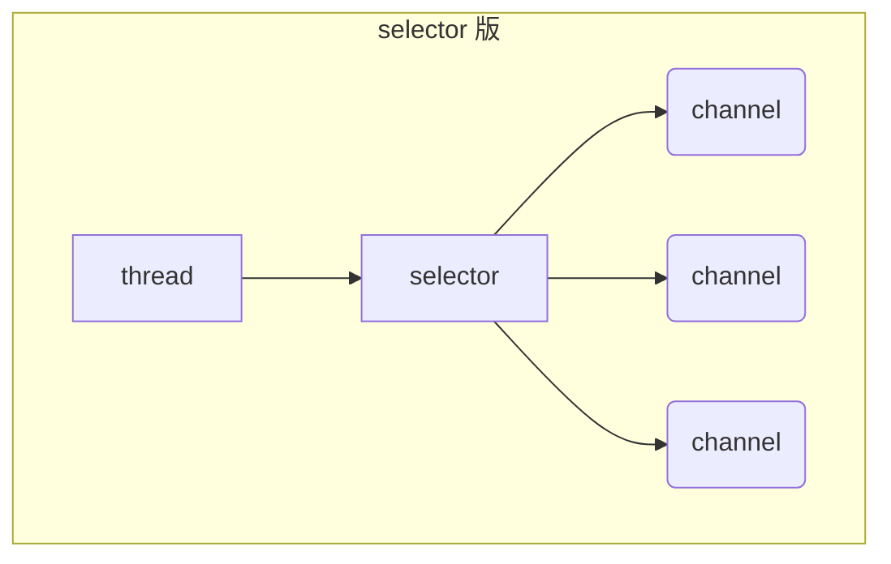
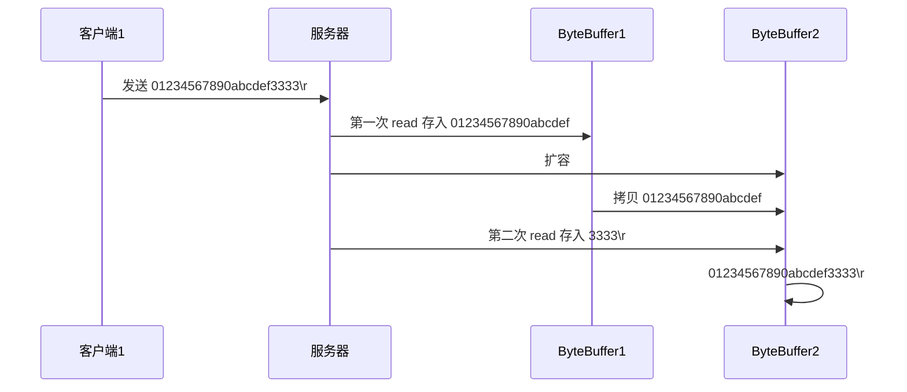

# Netty概述

## 使用背景


## 课程内容


## 学习收货


# NIO基础

==nio即为non-blocking io，非阻塞io==


## 三大组件

### Channel 


###  Buffer

==Channel用于传输数据，而写出读入需要有一个内存缓冲区，那就是Buffer==


### Selector

==服务器设计==

> 多线程版


> 线程池版设计


> selector版设计


## ByteBuffer

### ==入门案例==

```java
@Slf4j
public class TestByteBuffer {
    public static void main(String[] args) {
        // 1、通过输入输出流获得FileChannel   2、RandomAccessFile
        try (FileChannel channel = new FileInputStream("data.txt").getChannel()) { //try-with-resources
            //准备缓冲区
            ByteBuffer byteBuffer = ByteBuffer.allocate(10);
            while (true) {
                // 从 channel 读数据，即向 Buffer 写入
                int read = channel.read(byteBuffer);
                log.debug("读取到的字节数{}", read);
                if (read == -1) { //没有更多内容了
                    break;
                }
                //打印Buffer的内容
                byteBuffer.flip(); // 切换到读模式
                while (byteBuffer.hasRemaining()) { //是否还有剩余
                    byte b = byteBuffer.get(); //get()一直读一个字节
                    log.debug("实际字节{}", (char)b);
                }
                byteBuffer.clear(); //切换到写模式
            }
        } catch (IOException e) {
            e.printStackTrace();
        }
    }
}
// 日志
15:59:16.827 [main] DEBUG com.youens.netty.c1.TestByteBuffer - 读取到的字节数10
15:59:16.831 [main] DEBUG com.youens.netty.c1.TestByteBuffer - 实际字节1
15:59:16.832 [main] DEBUG com.youens.netty.c1.TestByteBuffer - 实际字节2
15:59:16.832 [main] DEBUG com.youens.netty.c1.TestByteBuffer - 实际字节3
15:59:16.832 [main] DEBUG com.youens.netty.c1.TestByteBuffer - 实际字节4
15:59:16.832 [main] DEBUG com.youens.netty.c1.TestByteBuffer - 实际字节5
15:59:16.832 [main] DEBUG com.youens.netty.c1.TestByteBuffer - 实际字节6
15:59:16.832 [main] DEBUG com.youens.netty.c1.TestByteBuffer - 实际字节7
15:59:16.832 [main] DEBUG com.youens.netty.c1.TestByteBuffer - 实际字节8
15:59:16.832 [main] DEBUG com.youens.netty.c1.TestByteBuffer - 实际字节9
15:59:16.832 [main] DEBUG com.youens.netty.c1.TestByteBuffer - 实际字节0
15:59:16.832 [main] DEBUG com.youens.netty.c1.TestByteBuffer - 读取到的字节数6
15:59:16.832 [main] DEBUG com.youens.netty.c1.TestByteBuffer - 实际字节a
15:59:16.832 [main] DEBUG com.youens.netty.c1.TestByteBuffer - 实际字节b
15:59:16.832 [main] DEBUG com.youens.netty.c1.TestByteBuffer - 实际字节c
15:59:16.832 [main] DEBUG com.youens.netty.c1.TestByteBuffer - 实际字节d
15:59:16.832 [main] DEBUG com.youens.netty.c1.TestByteBuffer - 实际字节r
15:59:16.832 [main] DEBUG com.youens.netty.c1.TestByteBuffer - 实际字节f
15:59:16.832 [main] DEBUG com.youens.netty.c1.TestByteBuffer - 读取到的字节数-1
```

###  ByteBuffer 正确使用姿势

1. 向 buffer 写入数据，例如调用 channel.read(buffer)
2. 调用 flip() 切换至**读模式**
3. 从 buffer 读取数据，例如调用 buffer.get()
4. 调用 clear() 或 compact() 切换至**写模式**
5. 重复 1~4 步骤

###  ByteBuffer 结构

ByteBuffer 有以下重要属性

* capacity
* position
* limit

一开始，刚刚创建


写模式下，position 是写入位置，limit 等于容量，下图表示写入了 4 个字节后的状态


==flip==()动作发生后，position 切换为读取位置，limit 切换为读取限制


读取（调用get() ） 4 个字节后，状态


==clear()== 动作发生后，状态恢复为刚创建时的状态


==compact()== 方法，是把未读完的部分向前压缩，然后切换至写模式，==即删除已读的，保留未读的==


#### 💡 调试工具类

```java
public class ByteBufferUtil {
    private static final char[] BYTE2CHAR = new char[256];
    private static final char[] HEXDUMP_TABLE = new char[256 * 4];
    private static final String[] HEXPADDING = new String[16];
    private static final String[] HEXDUMP_ROWPREFIXES = new String[65536 >>> 4];
    private static final String[] BYTE2HEX = new String[256];
    private static final String[] BYTEPADDING = new String[16];

    static {
        final char[] DIGITS = "0123456789abcdef".toCharArray();
        for (int i = 0; i < 256; i++) {
            HEXDUMP_TABLE[i << 1] = DIGITS[i >>> 4 & 0x0F];
            HEXDUMP_TABLE[(i << 1) + 1] = DIGITS[i & 0x0F];
        }

        int i;

        // Generate the lookup table for hex dump paddings
        for (i = 0; i < HEXPADDING.length; i++) {
            int padding = HEXPADDING.length - i;
            StringBuilder buf = new StringBuilder(padding * 3);
            for (int j = 0; j < padding; j++) {
                buf.append("   ");
            }
            HEXPADDING[i] = buf.toString();
        }

        // Generate the lookup table for the start-offset header in each row (up to 64KiB).
        for (i = 0; i < HEXDUMP_ROWPREFIXES.length; i++) {
            StringBuilder buf = new StringBuilder(12);
            buf.append(NEWLINE);
            buf.append(Long.toHexString(i << 4 & 0xFFFFFFFFL | 0x100000000L));
            buf.setCharAt(buf.length() - 9, '|');
            buf.append('|');
            HEXDUMP_ROWPREFIXES[i] = buf.toString();
        }

        // Generate the lookup table for byte-to-hex-dump conversion
        for (i = 0; i < BYTE2HEX.length; i++) {
            BYTE2HEX[i] = ' ' + StringUtil.byteToHexStringPadded(i);
        }

        // Generate the lookup table for byte dump paddings
        for (i = 0; i < BYTEPADDING.length; i++) {
            int padding = BYTEPADDING.length - i;
            StringBuilder buf = new StringBuilder(padding);
            for (int j = 0; j < padding; j++) {
                buf.append(' ');
            }
            BYTEPADDING[i] = buf.toString();
        }

        // Generate the lookup table for byte-to-char conversion
        for (i = 0; i < BYTE2CHAR.length; i++) {
            if (i <= 0x1f || i >= 0x7f) {
                BYTE2CHAR[i] = '.';
            } else {
                BYTE2CHAR[i] = (char) i;
            }
        }
    }

    /**
     * 打印所有内容
     * @param buffer
     */
    public static void debugAll(ByteBuffer buffer) {
        int oldlimit = buffer.limit();
        buffer.limit(buffer.capacity());
        StringBuilder origin = new StringBuilder(256);
        appendPrettyHexDump(origin, buffer, 0, buffer.capacity());
        System.out.println("+--------+-------------------- all ------------------------+----------------+");
        System.out.printf("position: [%d], limit: [%d]\n", buffer.position(), oldlimit);
        System.out.println(origin);
        buffer.limit(oldlimit);
    }

    /**
     * 打印可读取内容
     * @param buffer
     */
    public static void debugRead(ByteBuffer buffer) {
        StringBuilder builder = new StringBuilder(256);
        appendPrettyHexDump(builder, buffer, buffer.position(), buffer.limit() - buffer.position());
        System.out.println("+--------+-------------------- read -----------------------+----------------+");
        System.out.printf("position: [%d], limit: [%d]\n", buffer.position(), buffer.limit());
        System.out.println(builder);
    }

    private static void appendPrettyHexDump(StringBuilder dump, ByteBuffer buf, int offset, int length) {
        if (isOutOfBounds(offset, length, buf.capacity())) {
            throw new IndexOutOfBoundsException(
                    "expected: " + "0 <= offset(" + offset + ") <= offset + length(" + length
                            + ") <= " + "buf.capacity(" + buf.capacity() + ')');
        }
        if (length == 0) {
            return;
        }
        dump.append(
                "         +-------------------------------------------------+" +
                        NEWLINE + "         |  0  1  2  3  4  5  6  7  8  9  a  b  c  d  e  f |" +
                        NEWLINE + "+--------+-------------------------------------------------+----------------+");

        final int startIndex = offset;
        final int fullRows = length >>> 4;
        final int remainder = length & 0xF;

        // Dump the rows which have 16 bytes.
        for (int row = 0; row < fullRows; row++) {
            int rowStartIndex = (row << 4) + startIndex;

            // Per-row prefix.
            appendHexDumpRowPrefix(dump, row, rowStartIndex);

            // Hex dump
            int rowEndIndex = rowStartIndex + 16;
            for (int j = rowStartIndex; j < rowEndIndex; j++) {
                dump.append(BYTE2HEX[getUnsignedByte(buf, j)]);
            }
            dump.append(" |");

            // ASCII dump
            for (int j = rowStartIndex; j < rowEndIndex; j++) {
                dump.append(BYTE2CHAR[getUnsignedByte(buf, j)]);
            }
            dump.append('|');
        }

        // Dump the last row which has less than 16 bytes.
        if (remainder != 0) {
            int rowStartIndex = (fullRows << 4) + startIndex;
            appendHexDumpRowPrefix(dump, fullRows, rowStartIndex);

            // Hex dump
            int rowEndIndex = rowStartIndex + remainder;
            for (int j = rowStartIndex; j < rowEndIndex; j++) {
                dump.append(BYTE2HEX[getUnsignedByte(buf, j)]);
            }
            dump.append(HEXPADDING[remainder]);
            dump.append(" |");

            // Ascii dump
            for (int j = rowStartIndex; j < rowEndIndex; j++) {
                dump.append(BYTE2CHAR[getUnsignedByte(buf, j)]);
            }
            dump.append(BYTEPADDING[remainder]);
            dump.append('|');
        }

        dump.append(NEWLINE +
                "+--------+-------------------------------------------------+----------------+");
    }

    private static void appendHexDumpRowPrefix(StringBuilder dump, int row, int rowStartIndex) {
        if (row < HEXDUMP_ROWPREFIXES.length) {
            dump.append(HEXDUMP_ROWPREFIXES[row]);
        } else {
            dump.append(NEWLINE);
            dump.append(Long.toHexString(rowStartIndex & 0xFFFFFFFFL | 0x100000000L));
            dump.setCharAt(dump.length() - 9, '|');
            dump.append('|');
        }
    }

    public static short getUnsignedByte(ByteBuffer buffer, int index) {
        return (short) (buffer.get(index) & 0xFF);
    }
}
```

#### 调试

```java
public static void main(String[] args) {
        ByteBuffer byteBuffer = ByteBuffer.allocate(10);
        byteBuffer.put((byte) 0x61); // 'a'
        byteBuffer.put(new byte[]{0x62, 0x63, 0x64}); //b c d
        debugAll(byteBuffer); // 打印byteBuffer
        // System.out.println(byteBuffer.get());不切换模式直接读将读到0
        byteBuffer.flip();
        System.out.println((char)byteBuffer.get());
        debugAll(byteBuffer);

        byteBuffer.compact();
        debugAll(byteBuffer);
        byteBuffer.put(new byte[]{0x65, 0x66, 0x67}); //e f g
        debugAll(byteBuffer);
    }
// 输出
com.youens.netty.c1.TestBufferReadWrite
16:49:02.513 [main] DEBUG io.netty.util.internal.logging.InternalLoggerFactory - Using SLF4J as the default logging framework
+--------+-------------------- all ------------------------+----------------+
position: [4], limit: [10]
         +-------------------------------------------------+
         |  0  1  2  3  4  5  6  7  8  9  a  b  c  d  e  f |
+--------+-------------------------------------------------+----------------+
|00000000| 61 62 63 64 00 00 00 00 00 00                   |abcd......      |
+--------+-------------------------------------------------+----------------+


a
+--------+-------------------- all ------------------------+----------------+
position: [1], limit: [4]
         +-------------------------------------------------+
         |  0  1  2  3  4  5  6  7  8  9  a  b  c  d  e  f |
+--------+-------------------------------------------------+----------------+
|00000000| 61 62 63 64 00 00 00 00 00 00                   |abcd......      |
+--------+-------------------------------------------------+----------------+


+--------+-------------------- all ------------------------+----------------+
position: [3], limit: [10]
         +-------------------------------------------------+
         |  0  1  2  3  4  5  6  7  8  9  a  b  c  d  e  f |
+--------+-------------------------------------------------+----------------+
|00000000| 62 63 64 64 00 00 00 00 00 00                   |bcdd......      |
+--------+-------------------------------------------------+----------------+


+--------+-------------------- all ------------------------+----------------+
position: [6], limit: [10]
         +-------------------------------------------------+
         |  0  1  2  3  4  5  6  7  8  9  a  b  c  d  e  f |
+--------+-------------------------------------------------+----------------+
|00000000| 62 63 64 65 66 67 00 00 00 00                   |bcdefg....      |
+--------+-------------------------------------------------+----------------+


Process finished with exit code 0
```


### ByteBuffer 常见方法

#### 分配空间

可以使用 allocate 方法为 ByteBuffer 分配空间，其它 buffer 类也有该方法

```java
// 分配后的容量是固定的，不可再动态分配
//Netty对byteBuffer进行了增强，可动态分配容量
ByteBuffer buf = ByteBuffer.allocate(16);
	class java.nio.HeapByteBuffer	
// 使用堆内存，读写效率较低，受到 GC 的影响
        
        
ByteBuffer.allocateDirect(10)
     class java.nio.DirectByteBuffer
// 使用直接内存，效率较高（少一次拷贝），系统内存，不受 GC 的影响，分配较慢，需要合理的释放，否则可能造成内存泄漏
```


#### 向 buffer 写入数据

有两种办法

* 调用 channel 的 read 方法
* 调用 buffer 自己的 put 方法

```java
int readBytes = channel.read(buf);
```

和

```java
buf.put((byte)127);
```


#### 从 buffer 读取数据

同样有两种办法

* 调用 channel 的 write 方法
* 调用 buffer 自己的 get 方法

```java
int writeBytes = channel.write(buf);
```

和

```java
byte b = buf.get();
```

get 方法会让 position 读指针向后走，如果想重复读取数据

* 可以调用 ==rewind== 方法将 position 重新置为 0
* 或者调用 get(int i) 方法获取索引 i 的内容，它不会移动读指针


#### mark 和 reset

mark 是在读取时，做一个标记(即记录当前的position)，即使 position 改变，只要调用 reset 就能回到 mark 的位置

> **注意**
>
> rewind 和 flip 都会清除 mark 位置


#### 字符串与 ByteBuffer 互转

```java
// 字符串转ByteBuffer
// 1、先转为字符数组然后写到ByteBuffer
ByteBuffer buffer = ByteBuffer.allocate(16);
buffer.put("hello".getBytes());
debugAll(buffer);

//2、下面两种方法都会申请一个容量为字符串长度的byteBuffer，且自动切换为读模式	
ByteBuffer buffer1 = StandardCharsets.UTF_8.encode("你好");
//3、
ByteBuffer buffer2 = Charset.forName("utf-8").encode("你好");
//4、
ByteBuffer buffer3 = ByteBuffer.wrap("hello".getBytes());
        
debug(buffer1);
debug(buffer2);
// ByteBuffer转字符串
CharBuffer charBuffer = StandardCharsets.UTF_8.decode(buffer1); //在decode之前要确保byteBuffer是读模式
System.out.println(charBuffer.getClass());
System.out.println(charBuffer.toString());
```

输出

```
         +-------------------------------------------------+
         |  0  1  2  3  4  5  6  7  8  9  a  b  c  d  e  f |
+--------+-------------------------------------------------+----------------+
|00000000| e4 bd a0 e5 a5 bd                               |......          |
+--------+-------------------------------------------------+----------------+
         +-------------------------------------------------+
         |  0  1  2  3  4  5  6  7  8  9  a  b  c  d  e  f |
+--------+-------------------------------------------------+----------------+
|00000000| e4 bd a0 e5 a5 bd                               |......          |
+--------+-------------------------------------------------+----------------+
class java.nio.HeapCharBuffer
你好
```

#### ⚠️ Buffer 的线程安全

> Buffer 是**非线程安全的**


### Scattering Reads

分散读取，有一个文本文件 3parts.txt

```
onetwothree
```

使用如下方式读取，可以将数据填充至多个 buffer

```java
try (RandomAccessFile file = new RandomAccessFile("helloword/3parts.txt", "rw")) {
    FileChannel channel = file.getChannel();
    ByteBuffer a = ByteBuffer.allocate(3);
    ByteBuffer b = ByteBuffer.allocate(3);
    ByteBuffer c = ByteBuffer.allocate(5);
    channel.read(new ByteBuffer[]{a, b, c});
    a.flip();
    b.flip();
    c.flip();
    debugAll(a);
    debugAll(b);
    debugAll(c);
} catch (IOException e) {
    e.printStackTrace();
}
```

结果

```
         +-------------------------------------------------+
         |  0  1  2  3  4  5  6  7  8  9  a  b  c  d  e  f |
+--------+-------------------------------------------------+----------------+
|00000000| 6f 6e 65                                        |one             |
+--------+-------------------------------------------------+----------------+
         +-------------------------------------------------+
         |  0  1  2  3  4  5  6  7  8  9  a  b  c  d  e  f |
+--------+-------------------------------------------------+----------------+
|00000000| 74 77 6f                                        |two             |
+--------+-------------------------------------------------+----------------+
         +-------------------------------------------------+
         |  0  1  2  3  4  5  6  7  8  9  a  b  c  d  e  f |
+--------+-------------------------------------------------+----------------+
|00000000| 74 68 72 65 65                                  |three           |
+--------+-------------------------------------------------+----------------+
```


### Gathering Writes

使用如下方式写入，可以将多个 buffer 的数据填充至 channel

```java
public static void main(String[] args) {
        try (FileChannel channel = new RandomAccessFile("data.txt", "rw").getChannel()) {
            ByteBuffer byteBuffer1 = StandardCharsets.UTF_8.encode("hello");
            ByteBuffer byteBuffer2 = StandardCharsets.UTF_8.encode("world");
            ByteBuffer byteBuffer3 = StandardCharsets.UTF_8.encode("你好");

            channel.write(new ByteBuffer[]{byteBuffer1, byteBuffer2, byteBuffer3});
            debugAll(byteBuffer1);
            debugAll(byteBuffer2);
            debugAll(byteBuffer3);
        } catch (IOException e) {
            e.printStackTrace();
        }
    }
```

输出

```
+--------+-------------------- all ------------------------+----------------+
position: [0], limit: [5]
         +-------------------------------------------------+
         |  0  1  2  3  4  5  6  7  8  9  a  b  c  d  e  f |
+--------+-------------------------------------------------+----------------+
|00000000| 68 65 6c 6c 6f                                  |hello           |
+--------+-------------------------------------------------+----------------+


+--------+-------------------- all ------------------------+----------------+
position: [0], limit: [5]
         +-------------------------------------------------+
         |  0  1  2  3  4  5  6  7  8  9  a  b  c  d  e  f |
+--------+-------------------------------------------------+----------------+
|00000000| 77 6f 72 6c 64                                  |world           |
+--------+-------------------------------------------------+----------------+


+--------+-------------------- all ------------------------+----------------+
position: [0], limit: [6]
         +-------------------------------------------------+
         |  0  1  2  3  4  5  6  7  8  9  a  b  c  d  e  f |
+--------+-------------------------------------------------+----------------+
|00000000| e4 bd a0 e5 a5 bd 00 00 00 00 00                |...........     |
+--------+-------------------------------------------------+----------------+

```

文件内容

```
helloworld你好
```

### 黏包半包问题

网络上有多条数据发送给服务端，数据之间使用 \n 进行分隔
但由于某种原因这些数据在接收时，被进行了重新组合，例如原始数据有3条为

* Hello,world\n
* I'm zhangsan\n
* How are you?\n

变成了下面的两个 byteBuffer (黏包，半包)

* Hello,world\nI'm zhangsan\nHo    ==黏包，服务器一次性发送多条效率更高==
* w are you?\n    ==半包，接收缓冲区有限，需多次接收==

现在要求你编写程序，将错乱的数据恢复成原始的按 \n 分隔的数据

```java
public static void main(String[] args) {
    ByteBuffer source = ByteBuffer.allocate(32);
    //                     11            24
    source.put("Hello,world\nI'm zhangsan\nHo".getBytes());
    split(source);

    source.put("w are you?\nhaha!\n".getBytes());
    split(source);
}

private static void split(ByteBuffer source) {
    source.flip();
    int oldLimit = source.limit();
    for (int i = 0; i < oldLimit; i++) {
        if (source.get(i) == '\n') {
            ByteBuffer target = ByteBuffer.allocate(i + 1 - source.position());
            // 0 ~ limit
            source.limit(i + 1);
            target.put(source); // 从source 读，向 target 写
            debugAll(target);
            source.limit(oldLimit);
        }
    }
    source.compact();
}
```


## 文件编程

### 3.1 FileChannel

#### ⚠️ FileChannel 工作模式

> FileChannel 只能工作在阻塞模式下

#### 获取

不能直接打开 FileChannel，必须通过 ==FileInputStream==、==FileOutputStream== 或者 ==RandomAccessFile== 来获取 FileChannel，它们都有 getChannel 方法

* 通过 FileInputStream 获取的 channel ==只能读==
* 通过 FileOutputStream 获取的 channel ==只能写==
* 通过 RandomAccessFile 是否能读写根据构造 RandomAccessFile 时的==读写模式==决定

#### 读取

会从 channel 读取数据填充 ByteBuffer，返回值表示读到了多少字节，-1 表示到达了文件的末尾

```java
int readBytes = channel.read(buffer);
```


#### ==写入==

写入的正确姿势如下， SocketChannel

```java
ByteBuffer buffer = ...;
buffer.put(...); // 存入数据
buffer.flip();   // 切换读模式

while(buffer.hasRemaining()) {
    channel.write(buffer);
}
```

在 while 中调用 channel.write 是因为 write 方法并==不能保证一次将 buffer 中的内容全部写入 channel==


#### 关闭

channel 必须关闭，不过调用了 FileInputStream、FileOutputStream 或者 RandomAccessFile 的 close 方法会间接地调用 channel 的 close 方法


#### 位置

获取当前位置

```java
long pos = channel.position();
```

设置当前位置

```java
long newPos = ...;
channel.position(newPos);
```

设置当前位置时，如果设置为文件的末尾

* 这时读取会返回 -1 
* 这时写入，会追加内容，但要注意如果 position 超过了文件末尾，再写入时在新内容和原末尾之间会有空洞（00）


#### 大小

使用 size 方法获取文件的大小


#### 强制写入

操作系统出于性能的考虑，会将数据缓存，不是立刻写入磁盘。可以调用 force(true)  方法将文件内容和元数据（文件的权限等信息）立刻写入磁盘

### 3.2 两个 Channel 传输数据

```java
String FROM = "helloword/data.txt";
String TO = "helloword/to.txt";
long start = System.nanoTime();
try (FileChannel from = new FileInputStream(FROM).getChannel();
     FileChannel to = new FileOutputStream(TO).getChannel();
    ) {
    //名字有transferTo的方法，底层都会利用操作系统的零拷贝进行优化
    from.transferTo(0, from.size(), to);
} catch (IOException e) {
    e.printStackTrace();
}
long end = System.nanoTime();
System.out.println("transferTo 用时：" + (end - start) / 1000_000.0);
```

输出

```
transferTo 用时：8.2011
```

超过 2g 大小的文件传输

```java
public class TestFileChannelTransferTo {
    public static void main(String[] args) {
        try (
                FileChannel from = new FileInputStream("data.txt").getChannel();
                FileChannel to = new FileOutputStream("to.txt").getChannel();
        ) {
            // 效率高，底层会利用操作系统的零拷贝进行优化
            long size = from.size();
            // left 变量代表还剩余多少字节
            for (long left = size; left > 0; ) {
                System.out.println("position:" + (size - left) + " left:" + left);
                left -= from.transferTo((size - left), left, to);
            }
        } catch (IOException e) {
            e.printStackTrace();
        }
    }
}
```

实际传输一个超大文件

```
position:0 left:7769948160
position:2147483647 left:5622464513
position:4294967294 left:3474980866
position:6442450941 left:1327497219
```

### 3.3 Path

jdk7 引入了 Path 和 Paths 类

* Path 用来表示==文件==或者==文件夹==路径对象
* Paths 是工具类，用来获取 Path 实例

```java
Path source = Paths.get("1.txt"); // 相对路径 使用 user.dir 环境变量来定位 1.txt

Path source = Paths.get("d:\\1.txt"); // 绝对路径 代表了  d:\1.txt

Path source = Paths.get("d:/1.txt"); // 绝对路径 同样代表了  d:\1.txt

Path projects = Paths.get("d:\\data", "projects"); // 代表了  d:\data\projects
```

* `.` 代表了当前路径
* `..` 代表了上一级路径

例如目录结构如下

```
d:
	|- data
		|- projects
			|- a
			|- b
```

代码

```java
Path path = Paths.get("d:\\data\\projects\\a\\..\\b");
System.out.println(path);
System.out.println(path.normalize()); // 正常化路径
```

会输出

```
d:\data\projects\a\..\b
d:\data\projects\b
```


### 3.4 Files

jdk7 引入

检查文件或者文件夹是否存在

```java
Path path = Paths.get("helloword/data.txt");
System.out.println(Files.exists(path));
```


创建一级目录

```java
Path path = Paths.get("helloword/d1");
Files.createDirectory(path);
```

* 如果目录已存在，会抛异常 FileAlreadyExistsException
* 不能一次创建多级目录，否则会抛异常 NoSuchFileException


创建多级目录用

```java
Path path = Paths.get("helloword/d1/d2");
Files.createDirectories(path);
```


#### 拷贝文件

```java
Path source = Paths.get("helloword/data.txt");
Path target = Paths.get("helloword/target.txt");
// 效率与FileChannel类似，较高
Files.copy(source, target);
```

* 如果文件==已存在==，会抛异常 FileAlreadyExistsException

如果希望用 source 覆盖掉 target，需要用 ==StandardCopyOption==来控制

```java
Files.copy(source, target, StandardCopyOption.REPLACE_EXISTING);
```


移动文件

```java
Path source = Paths.get("helloword/data.txt");
Path target = Paths.get("helloword/data.txt");

Files.move(source, target, StandardCopyOption.ATOMIC_MOVE);
```

* StandardCopyOption.ATOMIC_MOVE 保证文件移动的原子性


删除文件

```java
Path target = Paths.get("helloword/target.txt");

Files.delete(target);
```

* 如果文件不存在，会抛异常 NoSuchFileException


删除目录

```java
Path target = Paths.get("helloword/d1");

Files.delete(target);
```

* 如果目录还有内容，会抛异常 DirectoryNotEmptyException


#### ==遍历目录文件==

```java
public static void main(String[] args) throws IOException {
    Path path = Paths.get("D:\Personal\Desktop\算法笔记");
    AtomicInteger dirCount = new AtomicInteger();
    AtomicInteger fileCount = new AtomicInteger();
    // 访问者模式应用
    Files.walkFileTree(path, new SimpleFileVisitor<Path>(){
        @Override
        public FileVisitResult preVisitDirectory(Path dir, BasicFileAttributes attrs) 
            throws IOException {
            System.out.println(dir);
            dirCount.incrementAndGet();
            return super.preVisitDirectory(dir, attrs);
        }

        @Override
        public FileVisitResult visitFile(Path file, BasicFileAttributes attrs) 
            throws IOException {
            System.out.println(file);
            fileCount.incrementAndGet();
            return super.visitFile(file, attrs);
        }
    });
    System.out.println(dirCount); // 104
    System.out.println(fileCount); // 149
}
```


统计 jar 的数目

```java
Path path = Paths.get("C:\\Program Files\\Java\\jdk1.8.0_91");
AtomicInteger fileCount = new AtomicInteger();
Files.walkFileTree(path, new SimpleFileVisitor<Path>(){
    @Override
    public FileVisitResult visitFile(Path file, BasicFileAttributes attrs) 
        throws IOException {
        if (file.toFile().getName().endsWith(".jar")) {
            fileCount.incrementAndGet();
        }
        return super.visitFile(file, attrs);
    }
});
System.out.println(fileCount); // 724
```


删除多级目录

```java
Path path = Paths.get("d:\\a");
Files.walkFileTree(path, new SimpleFileVisitor<Path>(){
    @Override
    public FileVisitResult visitFile(Path file, BasicFileAttributes attrs) 
        throws IOException {
        Files.delete(file);
        return super.visitFile(file, attrs);
    }

    @Override
    public FileVisitResult postVisitDirectory(Path dir, IOException exc) 
        throws IOException {
        Files.delete(dir);
        return super.postVisitDirectory(dir, exc);
    }
});
```


#### ⚠️ 删除目录

> 删除是危险操作，确保要递归删除的文件夹没有重要内容

```java
public static void deleteDir(String str) {
        try {
            Files.walkFileTree(Paths.get(str), new SimpleFileVisitor<Path>() {
                @Override
                public FileVisitResult visitFile(Path file, BasicFileAttributes attrs) throws IOException {
                    System.out.println("delete file: "+file);
                    Files.delete(file);
                    return super.visitFile(file, attrs);
                }
    
                @Override
                public FileVisitResult postVisitDirectory(Path dir, IOException exc) throws IOException {
                    System.out.println("delete dir: "+dir);
                    Files.delete(dir);
                    return super.postVisitDirectory(dir, exc);
                }
            });
        } catch (IOException e) {
            e.printStackTrace();
        }
        System.out.println("mission completed..");
}
```

#### 拷贝多级目录

```java
long start = System.currentTimeMillis();
String source = "D:\\Snipaste-1.16.2-x64";
String target = "D:\\Snipaste-1.16.2-x64aaa";

Files.walk(Paths.get(source)).forEach(path -> {
    try {
        String targetName = path.toString().replace(source, target);
        // 是目录
        if (Files.isDirectory(path)) {
            Files.createDirectory(Paths.get(targetName));
        }
        // 是普通文件
        else if (Files.isRegularFile(path)) {
            Files.copy(path, Paths.get(targetName));
        }
    } catch (IOException e) {
        e.printStackTrace();
    }
});
long end = System.currentTimeMillis();
System.out.println(end - start);
```


## 网络编程

### 4.1 非阻塞 vs 阻塞

#### 阻塞

* 阻塞模式下，相关方法都会导致线程暂停
  * ==ServerSocketChannel.accept== 会在没有连接建立时让线程暂停
  * ==SocketChannel.read== 会在没有数据可读时让线程暂停
  * 阻塞的表现其实就是线程暂停了，暂停期间==不会占用 cpu==，但线程==相当于闲置==
* ==单线程==下，阻塞方法之间==相互影响==，几乎不能正常工作，需要多线程支持
* 但多线程下，有新的问题，体现在以下方面
  * 32 位 jvm 一个线程 320k，64 位 jvm ==一个线程 1024k==，如果连接数过多，==必然导致 OOM==，并且线程太多，反而会因为==频繁上下文切换导致性能降低==
  * 可以采用线程池技术来减少线程数和线程上下文切换，但治标不治本，如果有很多连接建立，但长时间 inactive，会阻塞线程池中所有线程，因此不适合长连接，只适合短连接


服务器端

```java
// 使用 nio 来理解阻塞模式, 单线程
// 0. ByteBuffer
ByteBuffer buffer = ByteBuffer.allocate(16);
// 1. 创建了服务器
ServerSocketChannel ssc = ServerSocketChannel.open();

// 2. 绑定监听端口
ssc.bind(new InetSocketAddress(8080));

// 3. 连接集合
List<SocketChannel> channels = new ArrayList<>();
while (true) {
    // 4. accept 建立与客户端连接， SocketChannel 用来与客户端之间通信
    log.debug("connecting...");
    SocketChannel sc = ssc.accept(); // 阻塞方法，线程停止运行
    log.debug("connected... {}", sc);
    channels.add(sc);
    for (SocketChannel channel : channels) {
        // 5. 接收客户端发送的数据
        log.debug("before read... {}", channel);
        channel.read(buffer); // 阻塞方法，线程停止运行
        buffer.flip();
        debugRead(buffer);
        buffer.clear();
        log.debug("after read...{}", channel);
    }
}
```

客户端

```java
SocketChannel sc = SocketChannel.open();
sc.connect(new InetSocketAddress("localhost", 8080));
System.out.println("waiting...");
```


#### 非阻塞

* 非阻塞模式下，相关方法都会不会让线程暂停
  * 在 ServerSocketChannel.accept 在没有连接建立时，会==返回 null==，继续运行
  * SocketChannel.read 在没有数据可读时，会==返回 0==，但线程不必阻塞，可以去执行其它 SocketChannel 的 read 或是去执行 ServerSocketChannel.accept 
  * 写数据时，线程只是==等待数据写入 Channel==即可，==无需等 Channel 通过网络把数据发送==出去
* 但非阻塞模式下，即使没有连接建立，和可读数据，线程==仍然在不断运行==，白白==浪费了 cpu==
* 数据==复制==过程中，线程==实际还是阻塞==的（AIO 改进的地方）


服务器端，客户端代码不变

```java
// 使用 nio 来理解非阻塞模式, 单线程
// 0. ByteBuffer
ByteBuffer buffer = ByteBuffer.allocate(16);
// 1. 创建了服务器
ServerSocketChannel ssc = ServerSocketChannel.open();
ssc.configureBlocking(false); // 非阻塞模式
// 2. 绑定监听端口
ssc.bind(new InetSocketAddress(8080));
// 3. 连接集合
List<SocketChannel> channels = new ArrayList<>();
while (true) {
    // 4. accept 建立与客户端连接， SocketChannel 用来与客户端之间通信
    SocketChannel sc = ssc.accept(); // 非阻塞，线程还会继续运行，如果没有连接建立，但sc是null
    if (sc != null) {
        log.debug("connected... {}", sc);
        sc.configureBlocking(false); // 非阻塞模式
        channels.add(sc);
    }
    for (SocketChannel channel : channels) {
        // 5. 接收客户端发送的数据
        int read = channel.read(buffer);// 非阻塞，线程仍然会继续运行，如果没有读到数据，read 返回 0
        if (read > 0) {
            buffer.flip();
            debugRead(buffer);
            buffer.clear();
            log.debug("after read...{}", channel);
        }
    }
}
```


#### 多路复用

单线程可以配合 Selector 完成对多个 Channel 可读写事件的监控，这称之为多路复用

* 多路复用仅针对==网络 IO==，普通文件 IO 没法利用多路复用
* 如果不用 Selector 的非阻塞模式，线程大部分时间都在做无用功，而 Selector 能够保证
  * ==有可连接事件时才去连接==
  * ==有可读事件才去读取==
  * ==有可写事件才去写入==
    * 限于网络传输能力，Channel 未必时时可写，一旦 Channel 可写，会触发 Selector 的可写事件


### 4.2 Selector




好处

* 一个线程配合 selector 就可以监控多个 channel 的事件，事件发生线程才去处理。避免非阻塞模式下所做无用功
* 让这个线程能够被充分利用
* 节约了线程的数量
* 减少了线程上下文切换


#### 创建Selector

```java
Selector selector = Selector.open();
```


#### 绑定 Channel 事件

也称之为注册事件，绑定的事件 selector 才会关心 

```java
channel.configureBlocking(false);
SelectionKey key = channel.register(selector, 绑定事件);
```

* channel 必须工作在==非阻塞==模式
* FileChannel 没有非阻塞模式，因此不能配合 selector 一起使用
* 绑定的事件类型可以有
  * connect - 客户端连接成功时触发
  * accept - 服务器端成功接受连接时触发
  * read - 数据可读入时触发，有因为接收能力弱，数据暂不能读入的情况
  * write - 数据可写出时触发，有因为发送能力弱，数据暂不能写出的情况


#### 监听 Channel 事件

可以通过下面三种方法来监听是否有事件发生，方法的返回值代表有多少 channel 发生了事件

方法1，阻塞直到绑定事件发生

```java
int count = selector.select();
```


方法2，阻塞直到绑定事件发生，或是超时（时间单位为 ms）

```java
int count = selector.select(long timeout);
```


方法3，不会阻塞，也就是不管有没有事件，立刻返回，自己根据返回值检查是否有事件

```java
int count = selector.selectNow();
```


#### 💡 select 何时不阻塞

> * 事件发生时
>   * 客户端发起连接请求，会触发 accept 事件
>   * 客户端发送数据过来，客户端正常、异常关闭时，都会触发 read 事件，另外如果发送的数据大于 buffer 缓冲区，会触发多次读取事件
>   * channel 可写，会触发 write 事件
>   * 在 linux 下 nio bug 发生时
> * 调用 selector.wakeup()
> * 调用 selector.close()
> * selector 所在线程 interrupt


### 4.3 处理 accept 事件

客户端代码为

```java
public class Client {
    public static void main(String[] args) {
        try (Socket socket = new Socket("localhost", 8080)) {
            System.out.println(socket);
            socket.getOutputStream().write("world".getBytes());
            System.in.read();
        } catch (IOException e) {
            e.printStackTrace();
        }
    }
}
```


服务器端代码为

```java
@Slf4j
public class ChannelDemo6 {
    public static void main(String[] args) {
        try (ServerSocketChannel channel = ServerSocketChannel.open()) {
            channel.bind(new InetSocketAddress(8080));
            System.out.println(channel);
            Selector selector = Selector.open();
            channel.configureBlocking(false);
            channel.register(selector, SelectionKey.OP_ACCEPT);

            while (true) {
                int count = selector.select();
//                int count = selector.selectNow();
                log.debug("select count: {}", count);
//                if(count <= 0) {
//                    continue;
//                }

                // 获取所有事件
                Set<SelectionKey> keys = selector.selectedKeys();

                // 遍历所有事件，逐一处理
                Iterator<SelectionKey> iter = keys.iterator();
                while (iter.hasNext()) {
                    SelectionKey key = iter.next();
                    // 判断事件类型
                    if (key.isAcceptable()) {
                        ServerSocketChannel c = (ServerSocketChannel) key.channel();
                        // 必须处理
                        SocketChannel sc = c.accept();
                        log.debug("{}", sc);
                    }
                    // 处理完毕，必须将事件移除
                    iter.remove();
                }
            }
        } catch (IOException e) {
            e.printStackTrace();
        }
    }
}
```


#### 💡 事件发生后能否不处理

> 事件发生后，要么处理，要么取消（cancel），不能什么都不做，否则下次该事件仍会触发，这是因为 nio 底层使用的是水平触发


### 4.4 处理 read 事件

```java
@Slf4j
public class ChannelDemo6 {
    public static void main(String[] args) {
        try (ServerSocketChannel channel = ServerSocketChannel.open()) {
            channel.bind(new InetSocketAddress(8080));
            System.out.println(channel);
            Selector selector = Selector.open();
            channel.configureBlocking(false);
            channel.register(selector, SelectionKey.OP_ACCEPT);

            while (true) {
                int count = selector.select();
//                int count = selector.selectNow();
                log.debug("select count: {}", count);
//                if(count <= 0) {
//                    continue;
//                }

                // 获取所有事件
                Set<SelectionKey> keys = selector.selectedKeys();

                // 遍历所有事件，逐一处理
                Iterator<SelectionKey> iter = keys.iterator();
                while (iter.hasNext()) {
                    SelectionKey key = iter.next();
                    // 必须将事件移除
                    iter.remove();
                    // 判断事件类型
                    if (key.isAcceptable()) {
                        ServerSocketChannel c = (ServerSocketChannel) key.channel();
                        // 必须处理
                        SocketChannel sc = c.accept();
                        sc.configureBlocking(false);
                        sc.register(selector, SelectionKey.OP_READ); 
                        log.debug("连接已建立: {}", sc);
                    } else if (key.isReadable()) {
                        try { // 若客户端强行关闭了连接（客户端停机），channel.read()将会出异常
                        SocketChannel channel = (SocketChannel) key.channel(); // 拿到发生事件的channel
                        ByteBuffer byteBuffer = ByteBuffer.allocate(16);
                        int read = channel.read(byteBuffer);//如果连接是正常断开，会返回-1。断开后，还会产生一个read事件
                        if (read == -1) {
                            key.cancel();// 不再监听该socketChannel
                        } else {
                            byteBuffer.flip();
                            debugRead(byteBuffer);
                        }
                    } catch (IOException e) {
                        e.printStackTrace();
                        // 事件必须被处理，连接已断开，所以可以把key取消掉(从 selector 的 keys 集合中真正删除，也就是取消						注册)
                        key.cancel();// 不再监听该socketChannel
                    }
                    
                }
            }
        } catch (IOException e) {
            e.printStackTrace();
        }
    }
}
```

开启两个客户端，修改一下发送文字，输出

```
sun.nio.ch.ServerSocketChannelImpl[/0:0:0:0:0:0:0:0:8080]
21:16:39 [DEBUG] [main] c.i.n.ChannelDemo6 - select count: 1
21:16:39 [DEBUG] [main] c.i.n.ChannelDemo6 - 连接已建立: java.nio.channels.SocketChannel[connected local=/127.0.0.1:8080 remote=/127.0.0.1:60367]
21:16:39 [DEBUG] [main] c.i.n.ChannelDemo6 - select count: 1
         +-------------------------------------------------+
         |  0  1  2  3  4  5  6  7  8  9  a  b  c  d  e  f |
+--------+-------------------------------------------------+----------------+
|00000000| 68 65 6c 6c 6f                                  |hello           |
+--------+-------------------------------------------------+----------------+
21:16:59 [DEBUG] [main] c.i.n.ChannelDemo6 - select count: 1
21:16:59 [DEBUG] [main] c.i.n.ChannelDemo6 - 连接已建立: java.nio.channels.SocketChannel[connected local=/127.0.0.1:8080 remote=/127.0.0.1:60378]
21:16:59 [DEBUG] [main] c.i.n.ChannelDemo6 - select count: 1
         +-------------------------------------------------+
         |  0  1  2  3  4  5  6  7  8  9  a  b  c  d  e  f |
+--------+-------------------------------------------------+----------------+
|00000000| 77 6f 72 6c 64                                  |world           |
+--------+-------------------------------------------------+----------------+
```


#### 💡 为何要 iter.remove()

> 因为 select 在事件发生后，就会将相关的 key 放入 selectedKeys 集合，但不会在处理完后从 selectedKeys 集合中移除，需要我们自己编码删除。例如
>
> * 第一次触发了 ssckey 上的 accept 事件，没有移除 ssckey 
> * 第二次触发了 sckey 上的 read 事件，但这时 selectedKeys 中还有上次的 ssckey ，在处理时因为没有真正的 serverSocket 连上了，就会导致空指针异常


#### 💡 cancel 的作用

> cancel 会取消注册在 selector 上的 channel，并从 keys 集合中删除 key 后续不会再监听事件


#### ⚠️  不处理边界的问题

以前有同学写过这样的代码，思考注释中两个问题，以 bio 为例，其实 nio 道理是一样的

```java
public class Server {
    public static void main(String[] args) throws IOException {
        ServerSocket ss=new ServerSocket(9000);
        while (true) {
            Socket s = ss.accept();
            InputStream in = s.getInputStream();
            // 这里这么写，有没有问题
            byte[] arr = new byte[4];
            while(true) {
                int read = in.read(arr);
                // 这里这么写，有没有问题
                if(read == -1) {
                    break;
                }
                System.out.println(new String(arr, 0, read));
            }
        }
    }
}
```

客户端

```java
public class Client {
    public static void main(String[] args) throws IOException {
        Socket max = new Socket("localhost", 9000);
        OutputStream out = max.getOutputStream();
        out.write("hello".getBytes());
        out.write("world".getBytes());
        out.write("你好".getBytes());
        max.close();
    }
}
```

输出

```
hell
owor
ld�
�好
你 字的3个字节被拆成了两半，无法成功decode
```

为什么？


#### 处理消息的边界


* 一种思路是固定消息长度，数据包大小一样，服务器按预定长度读取，缺点是==浪费带宽==和==浪费空间==
* 另一种思路是按分隔符拆分，需要一个一个字节比对，缺点是==效率低==
* TLV 格式，即 Type 类型、Length 长度、Value 数据，类型和长度已知的情况下，就可以方便获取消息大小，分配合适的 buffer，缺点是 buffer 需要提前分配，如果内容过大，则影响 server 吞吐量
  * Http 1.1 是 TLV 格式
  * Http 2.0 是 LTV 格式

#### ByteBuffer容量不够出现的问题

```java
//客户端发送一个大于byteBuffer的容量(16)的消息
sc.write(Charset.defaultCharset().encode("01234567890abcdef3333\n"));
// 服务器只会输出：
+--------+-------------------- all ------------------------+----------------+
position: [6], limit: [6]
         +-------------------------------------------------+
         |  0  1  2  3  4  5  6  7  8  9  a  b  c  d  e  f |
+--------+-------------------------------------------------+----------------+
|00000000| 66 33 33 33 33 0a                               |f3333.          |
+--------+-------------------------------------------------+----------------+
// 前面16个字节被抛弃了，原因是在前16个字节中，并没有遇到分隔符\n，split无法处理不服，而且byteBuffer是局部变量，当第二次去处理时，已经是一个新的byteBuffer，原来的数据已丢失。
```

==使用附件进行解决==




服务器端

```java
private static void split(ByteBuffer source) {
    source.flip();
    for (int i = 0; i < source.limit(); i++) {
        // 找到一条完整消息
        if (source.get(i) == '\n') {
            int length = i + 1 - source.position();
            // 把这条完整消息存入新的 ByteBuffer
            ByteBuffer target = ByteBuffer.allocate(length);
            // 从 source 读，向 target 写
            for (int j = 0; j < length; j++) {
                target.put(source.get());
            }
            debugAll(target);
        }
    }
    source.compact(); // 0123456789abcdef  position 16 limit 16
}

public static void main(String[] args) throws IOException {
    // 1. 创建 selector, 管理多个 channel
    Selector selector = Selector.open();
    ServerSocketChannel ssc = ServerSocketChannel.open();
    ssc.configureBlocking(false);
    // 2. 建立 selector 和 channel 的联系（注册）
    // SelectionKey 就是将来事件发生后，通过它可以知道事件和哪个channel的事件
    SelectionKey sscKey = ssc.register(selector, 0, null);
    // key 只关注 accept 事件
    sscKey.interestOps(SelectionKey.OP_ACCEPT);
    log.debug("sscKey:{}", sscKey);
    ssc.bind(new InetSocketAddress(8080));
    while (true) {
        // 3. select 方法, 没有事件发生，线程阻塞，有事件，线程才会恢复运行
        // select 在事件未处理时，它不会阻塞, 事件发生后要么处理，要么取消，不能置之不理
        selector.select();
        // 4. 处理事件, selectedKeys 内部包含了所有发生的事件
        Iterator<SelectionKey> iter = selector.selectedKeys().iterator(); // accept, read
        while (iter.hasNext()) {
            SelectionKey key = iter.next();
            // 处理key 时，要从 selectedKeys 集合中删除，否则下次处理就会有问题
            iter.remove();
            log.debug("key: {}", key);
            // 5. 区分事件类型
            if (key.isAcceptable()) { // 如果是 accept
                ServerSocketChannel channel = (ServerSocketChannel) key.channel();
                SocketChannel sc = channel.accept();
                sc.configureBlocking(false);
                ByteBuffer buffer = ByteBuffer.allocate(16); // attachment
                
                
                // 将一个 byteBuffer 作为附件关联到 selectionKey 上
                SelectionKey scKey = sc.register(selector, 0, buffer);
                
                
                scKey.interestOps(SelectionKey.OP_READ);
                log.debug("{}", sc);
                log.debug("scKey:{}", scKey);
            } else if (key.isReadable()) { // 如果是 read
                try {
                    SocketChannel channel = (SocketChannel) key.channel(); // 拿到触发事件的channel
                    
                    
                    // 获取 selectionKey 上关联的附件
                    ByteBuffer buffer = (ByteBuffer) key.attachment();
                    
                    
                    int read = channel.read(buffer); // 如果是正常断开，read 的方法的返回值是 -1
                    if(read == -1) {
                        key.cancel();
                    } else {
                        split(buffer);
                        // 需要扩容
                        if (buffer.position() == buffer.limit()) {
                            ByteBuffer newBuffer = ByteBuffer.allocate(buffer.capacity() * 2);
                            buffer.flip();
                            newBuffer.put(buffer); // 0123456789abcdef3333\n
                            key.attach(newBuffer);
                        }
                    }

                } catch (IOException e) {
                    e.printStackTrace();
                    key.cancel();  // 因为客户端断开了,因此需要将 key 取消（从 selector 的 keys 集合中真正删除 key）
                }
            }
        }
    }
}
```

客户端

```java
SocketChannel sc = SocketChannel.open();
sc.connect(new InetSocketAddress("localhost", 8080));
SocketAddress address = sc.getLocalAddress();
// sc.write(Charset.defaultCharset().encode("hello\nworld\n"));
sc.write(Charset.defaultCharset().encode("0123\n456789abcdef"));
sc.write(Charset.defaultCharset().encode("0123456789abcdef3333\n"));
System.in.read();
```


#### ByteBuffer 大小分配

* 每个 channel 都需要记录可能被切分的消息，因为 ByteBuffer 不能被多个 channel 共同使用，因此需要为每个 channel 维护一个独立的 ByteBuffer
* ByteBuffer 不能太大，比如一个 ByteBuffer 1Mb 的话，要支持百万连接就要 1Tb 内存，因此需要设计大小可变的 ByteBuffer
  * 一种思路是首先分配一个较小的 buffer，例如 4k，如果发现数据不够，再分配 8k 的 buffer，将 4k buffer 内容拷贝至 8k buffer，优点是消息连续容易处理，缺点是数据拷贝耗费性能，参考实现 [http://tutorials.jenkov.com/java-performance/resizable-array.html](http://tutorials.jenkov.com/java-performance/resizable-array.html)
  * 另一种思路是用多个数组组成 buffer，一个数组不够，把多出来的内容写入新的数组，与前面的区别是消息存储不连续解析复杂，优点是避免了拷贝引起的性能损耗


### 4.5 处理 write 事件

#### 一次无法写完例子

* ==非阻塞模式下，无法保证把 buffer 中所有数据都写入 channel，因此需要追踪 write 方法的返回值（代表实际写入字节数），如果用while循环写入，当缓冲区满的时候，将无法写入，write()将返回0，此时线程将会在此卡住，直到可写入缓冲区==
* 用 selector 监听所有 channel 的可写事件，每个 channel 都需要一个 key 来跟踪 buffer，但这样又会导致占用内存过多，就有两阶段策略
  * 当消息处理器第一次写入消息时，才将 channel 注册到 selector 上
  * selector 检查 channel 上的可写事件，如果所有的数据写完了，就取消 channel 的注册
  * 如果不取消，会每次可写均会触发 write 事件


```java
public class WriteServer {

    public static void main(String[] args) throws IOException {
        ServerSocketChannel ssc = ServerSocketChannel.open();
        ssc.configureBlocking(false);
        ssc.bind(new InetSocketAddress(8080));

        Selector selector = Selector.open();
        ssc.register(selector, SelectionKey.OP_ACCEPT);

        while(true) {
            selector.select();

            Iterator<SelectionKey> iter = selector.selectedKeys().iterator();
            while (iter.hasNext()) {
                SelectionKey key = iter.next();
                iter.remove();
                if (key.isAcceptable()) {
                    SocketChannel sc = ssc.accept();
                    sc.configureBlocking(false);
                    SelectionKey sckey = sc.register(selector, SelectionKey.OP_READ);
                    // 1. 向客户端发送内容
                    StringBuilder sb = new StringBuilder();
                    for (int i = 0; i < 3000000; i++) {
                        sb.append("a");
                    }
                    ByteBuffer buffer = Charset.defaultCharset().encode(sb.toString());
                    int write = sc.write(buffer);
                    // 3. write 表示实际写了多少字节
                    System.out.println("实际写入字节:" + write);
                    // 4. 如果有剩余未读字节，才需要关注写事件
                    if (buffer.hasRemaining()) {
                        // read 1  write 4
                        // 在原有关注事件的基础上，多关注 写事件
                        sckey.interestOps(sckey.interestOps() + SelectionKey.OP_WRITE);
                        // 把 buffer 作为附件加入 sckey
                        sckey.attach(buffer);
                    }
                } else if (key.isWritable()) {
                    ByteBuffer buffer = (ByteBuffer) key.attachment();
                    SocketChannel sc = (SocketChannel) key.channel();
                    int write = sc.write(buffer);
                    System.out.println("实际写入字节:" + write);
                    if (!buffer.hasRemaining()) { // 写完了
                        key.interestOps(key.interestOps() - SelectionKey.OP_WRITE);
                        key.attach(null);
                    }
                }
            }
        }
    }
}
```

客户端

```java
public class WriteClient {
    public static void main(String[] args) throws IOException {
        Selector selector = Selector.open();
        SocketChannel sc = SocketChannel.open();
        sc.configureBlocking(false);
        sc.register(selector, SelectionKey.OP_CONNECT | SelectionKey.OP_READ);
        sc.connect(new InetSocketAddress("localhost", 8080));
        int count = 0;
        while (true) {
            selector.select();
            Iterator<SelectionKey> iter = selector.selectedKeys().iterator();
            while (iter.hasNext()) {
                SelectionKey key = iter.next();
                iter.remove();
                if (key.isConnectable()) {
                    System.out.println(sc.finishConnect());
                } else if (key.isReadable()) {
                    ByteBuffer buffer = ByteBuffer.allocate(1024 * 1024);
                    count += sc.read(buffer);
                    buffer.clear();
                    System.out.println(count);
                }
            }
        }
    }
}
```


#### 💡 write 为何要取消

只要向 channel 发送数据时，socket 缓冲可写，这个事件会频繁触发，因此应当只在 socket 缓冲区写不下时再关注可写事件，数据写完之后再取消关注


### 4.6 更进一步多线程


#### 💡 利用多线程优化

> 现在都是多核 cpu，设计时要充分考虑别让 cpu 的力量被白白浪费


前面的代码只有一个选择器，没有充分利用多核 cpu，如何改进呢？

分两组选择器

* 单线程配一个选择器，专门处理 accept 事件
* 创建 cpu 核心数的线程，每个线程配一个选择器，轮流处理 read 事件

#### 单worker

服务端

```java
@Slf4j
public class MultiThreadServer {
    public static void main(String[] args) throws IOException {
        Thread.currentThread().setName("boss");
        ServerSocketChannel ssc = ServerSocketChannel.open();
        ssc.configureBlocking(false);
        Selector boss = Selector.open();
        SelectionKey bossKey = ssc.register(boss, SelectionKey.OP_ACCEPT);
        ssc.bind(new InetSocketAddress(8080));
        Worker worker = new Worker("worker-0");


        while (true) {
            boss.select();
            Iterator<SelectionKey> iter = boss.selectedKeys().iterator();
            while (iter.hasNext()) {
                SelectionKey key = iter.next();
                iter.remove();
                if (key.isAcceptable()) {
                    SocketChannel sc = ssc.accept();
                    log.debug("connected...{}", sc.getRemoteAddress());
                    sc.configureBlocking(false);
                    log.debug("before register...{}", sc.getRemoteAddress());
                    
                    worker.register(sc);
                    
                    log.debug("after register...{}", sc.getRemoteAddress());
                    
                }
            }
        }

    }

    static class Worker implements Runnable {
        private Thread thread;
        private Selector selector;
        private String name;
        private volatile boolean start = false;
        private ConcurrentLinkedQueue<Runnable> queue = new ConcurrentLinkedQueue<>(); //解决线程之间传递数据


        public Worker(String name) {
            this.name = name;
        }

        public void register(SocketChannel sc) throws IOException {
            if (!start) {
                selector = selector.open();
                thread = new Thread(this, name);
                thread.start();
                start = true;
            }
            //向队列添加任务，但任务没有执行
            queue.add(() -> {
                try {
                    log.debug("add task...");
                    sc.register(selector, SelectionKey.OP_READ, null);
                } catch (ClosedChannelException e) {
                    e.printStackTrace();
                }
            });
            selector.wakeup(); //不要让select阻塞，以添加事件
            log.debug("wakeup...");
        }

        @Override
        public void run() {
            while (true) {
                try {
                    log.debug("before select");
                    selector.select();// 阻塞，wakeup
                    log.debug("after wakeup...");
                    Runnable task = queue.poll(); // 取出事件，注册到selector
                    if (task != null) {
                        task.run();
                    }
                    Iterator<SelectionKey> iter = selector.selectedKeys().iterator();
                    while (iter.hasNext()) {
                        SelectionKey key = iter.next();
                        log.debug("key: {}", key);
                        iter.remove();
                        if (key.isReadable()) {
                            log.debug("read....");
                            ByteBuffer buffer = ByteBuffer.allocate(16);
                            SocketChannel channel = (SocketChannel) key.channel();
                            log.debug("read...{}", channel.getRemoteAddress());
                            channel.read(buffer);
                            buffer.flip();
                            debugAll(buffer);
                        }
                    }
                } catch (IOException e) {
                    e.printStackTrace();
                }
            }
        }
    }
}
```


#### 可能出现的问题

```java
//工作线程的selector.select()
//boss线程的sc.register(worker.selector, 0, null)
//如果selector.select()执行在前，工作线程将被阻塞， sc.register(worker.selector, 0, null)执行在后
//当boss调用sc.register(worker.selector,0,null)，获取worker.selector时，也被阻塞
//worker.selector是共享变量
```

#### 问题解决方法

**==使用ConcurrentLinkedQueue来解决=**=

==使用ConcurrentLinkedQueue队列，将在boss线程执行的register交给worker线程执行。==

**另一种解决方式**


```java
//上图三条代码任意执行顺序均可保证结果正确
public void register(SocketChannel sc) throws IOException {
    if (!start) {
        selector = selector.open();
        thread = new Thread(this, name);
        thread.start();
        start = true;
    }
    selector.wakeup(); //不要让select阻塞，以添加事件
    sc.register(selector, SelectionKey.OP_READ, null);
}
```


#### 多worker

```java
public class ChannelDemo7 {
    public static void main(String[] args) throws IOException {
        new BossEventLoop().register();
    }


    @Slf4j
    static class BossEventLoop implements Runnable {
        private Selector boss;
        private WorkerEventLoop[] workers;
        private volatile boolean start = false;
        AtomicInteger index = new AtomicInteger();

        public void register() throws IOException {
            if (!start) {
                ServerSocketChannel ssc = ServerSocketChannel.open();
                ssc.bind(new InetSocketAddress(8080));
                ssc.configureBlocking(false);
                boss = Selector.open();
                SelectionKey ssckey = ssc.register(boss, 0, null);
                ssckey.interestOps(SelectionKey.OP_ACCEPT);
                workers = initEventLoops();
                new Thread(this, "boss").start();
                log.debug("boss start...");
                start = true;
            }
        }

        public WorkerEventLoop[] initEventLoops() {
//        EventLoop[] eventLoops = new EventLoop[Runtime.getRuntime().availableProcessors()];
            WorkerEventLoop[] workerEventLoops = new WorkerEventLoop[2];
            for (int i = 0; i < workerEventLoops.length; i++) {
                workerEventLoops[i] = new WorkerEventLoop(i);
            }
            return workerEventLoops;
        }

        @Override
        public void run() {
            while (true) {
                try {
                    boss.select();
                    Iterator<SelectionKey> iter = boss.selectedKeys().iterator();
                    while (iter.hasNext()) {
                        SelectionKey key = iter.next();
                        iter.remove();
                        if (key.isAcceptable()) {
                            ServerSocketChannel c = (ServerSocketChannel) key.channel();
                            SocketChannel sc = c.accept();
                            sc.configureBlocking(false);
                            log.debug("{} connected", sc.getRemoteAddress());
                            workers[index.getAndIncrement() % workers.length].register(sc);
                        }
                    }
                } catch (IOException e) {
                    e.printStackTrace();
                }
            }
        }
    }

    @Slf4j
    static class WorkerEventLoop implements Runnable {
        private Selector worker;
        private volatile boolean start = false;
        private int index;

        private final ConcurrentLinkedQueue<Runnable> tasks = new ConcurrentLinkedQueue<>();

        public WorkerEventLoop(int index) {
            this.index = index;
        }

        public void register(SocketChannel sc) throws IOException {
            if (!start) {
                worker = Selector.open();
                new Thread(this, "worker-" + index).start();
                start = true;
            }
            tasks.add(() -> {
                try {
                    SelectionKey sckey = sc.register(worker, 0, null);
                    sckey.interestOps(SelectionKey.OP_READ);
                    worker.selectNow();
                } catch (IOException e) {
                    e.printStackTrace();
                }
            });
            worker.wakeup();
        }

        @Override
        public void run() {
            while (true) {
                try {
                    worker.select();
                    Runnable task = tasks.poll();
                    if (task != null) {
                        task.run();
                    }
                    Set<SelectionKey> keys = worker.selectedKeys();
                    Iterator<SelectionKey> iter = keys.iterator();
                    while (iter.hasNext()) {
                        SelectionKey key = iter.next();
                        if (key.isReadable()) {
                            SocketChannel sc = (SocketChannel) key.channel();
                            ByteBuffer buffer = ByteBuffer.allocate(128);
                            try {
                                int read = sc.read(buffer);
                                if (read == -1) {
                                    key.cancel();
                                    sc.close();
                                } else {
                                    buffer.flip();
                                    log.debug("{} message:", sc.getRemoteAddress());
                                    debugAll(buffer);
                                }
                            } catch (IOException e) {
                                e.printStackTrace();
                                key.cancel();
                                sc.close();
                            }
                        }
                        iter.remove();
                    }
                } catch (IOException e) {
                    e.printStackTrace();
                }
            }
        }
    }
}
```


#### 💡 如何拿到 cpu 个数

> * Runtime.getRuntime().availableProcessors() 如果工作在 docker 容器下，因为容器不是物理隔离的，会拿到物理 cpu 个数，而不是容器申请时的个数
> * 这个问题直到 jdk 10 才修复，使用 jvm 参数 UseContainerSupport 配置， 默认开启


### 4.7 UDP

* UDP 是无连接的，client 发送数据不会管 server 是否开启
* server 这边的 receive 方法会将接收到的数据存入 byte buffer，但如果数据报文超过 buffer 大小，多出来的数据会被默默抛弃

首先启动服务器端

```java
public class UdpServer {
    public static void main(String[] args) {
        try (DatagramChannel channel = DatagramChannel.open()) {
            channel.socket().bind(new InetSocketAddress(9999));
            System.out.println("waiting...");
            ByteBuffer buffer = ByteBuffer.allocate(32);
            channel.receive(buffer);
            buffer.flip();
            debug(buffer);
        } catch (IOException e) {
            e.printStackTrace();
        }
    }
}
```

输出

```
waiting...
```


运行客户端

```java
public class UdpClient {
    public static void main(String[] args) {
        try (DatagramChannel channel = DatagramChannel.open()) {
            ByteBuffer buffer = StandardCharsets.UTF_8.encode("hello");
            InetSocketAddress address = new InetSocketAddress("localhost", 9999);
            channel.send(buffer, address);
        } catch (Exception e) {
            e.printStackTrace();
        }
    }
}
```

接下来服务器端输出

```
         +-------------------------------------------------+
         |  0  1  2  3  4  5  6  7  8  9  a  b  c  d  e  f |
+--------+-------------------------------------------------+----------------+
|00000000| 68 65 6c 6c 6f                                  |hello           |
+--------+-------------------------------------------------+----------------+
```


## BIO VS BIO

### 5.1 stream vs channel

* stream 不会自动缓冲数据，channel 会利用系统提供的发送缓冲区、接收缓冲区（更为底层）
* stream 仅支持阻塞 API，channel 同时支持阻塞、非阻塞 API，网络 channel 可配合 selector 实现多路复用
* 二者均为全双工，即读写可以同时进行


### 5.2 IO 模型

**==同步阻塞（对应阻塞io模型）==**

**==同步非阻塞（对应非阻塞io模型）==**

**==同步多路复用（对应多路复用io模型）==**

**==异步阻塞（没有此情况）==**

**==异步非阻塞（对应异步io模型）==**

* ==同步：线程自己去获取结果（一个线程）==
* ==异步：线程自己不去获取结果，而是由其它线程送结果（至少两个线程）==


当调用一次 channel.read 或 stream.read 后，会切换至操作系统内核态来完成真正数据读取，而读取又分为两个阶段，分别为：

* 等待数据阶段
* 复制数据阶段


* 阻塞 IO

  

* 非阻塞  IO

  

* 多路复用

  

* 信号驱动

* 异步 IO

  

* 阻塞 IO vs 多路复用

  ==阻塞io一个线程处理不了多种事件，而多路复用可以==

  
  
  

#### 🔖 参考

UNIX 网络编程 - 卷 I


### 5.3 零拷贝

#### 传统 IO 问题

传统的 IO 将一个文件通过 socket 写出

```java
File f = new File("helloword/data.txt");
RandomAccessFile file = new RandomAccessFile(file, "r");

byte[] buf = new byte[(int)f.length()];
file.read(buf);

Socket socket = ...;
socket.getOutputStream().write(buf);
```

内部工作流程是这样的：


1. java 本身并不具备 IO 读写能力，因此 read 方法调用后，要从 java 程序的**用户态**切换至**内核态**，去调用操作系统内涵（Kernel）的读能力，将数据读入**内核缓冲区**。这期间用户线程阻塞，操作系统使用 DMA（Direct Memory Access）来实现文件读，其间也不会使用 cpu

   > DMA 也可以理解为硬件单元，用来解放 cpu 完成文件 IO

2. 从**内核态**切换回**用户态**，将数据从**内核缓冲区**读入**用户缓冲区**（即 byte[] buf），这期间 cpu 会参与拷贝，无法利用 DMA

3. 调用 write 方法，这时将数据从**用户缓冲区**（byte[] buf）写入 **socket 缓冲区**，cpu 会参与拷贝

4. 接下来要向网卡写数据，这项能力 java 又不具备，因此又得从**用户态**切换至**内核态**，调用操作系统的写能力，使用 DMA 将 **socket 缓冲区**的数据写入网卡，不会使用 cpu


可以看到中间环节较多，java 的 IO 实际不是物理设备级别的读写，而是缓存的复制，底层的真正读写是操作系统来完成的

* 用户态与内核态的切换发生了 3 次，这个操作比较重量级
* 数据拷贝了共 4 次


#### NIO 优化

通过 DirectByteBuf 

* ByteBuffer.allocate(10)  HeapByteBuffer ==使用的还是 java 内存==
* ByteBuffer.allocateDirect(10)  DirectByteBuffer ==使用的是操作系统内存==


大部分步骤与优化前相同，不再赘述。唯有一点：java 可以使用 DirectByteBuf 将堆外内存映射到 jvm 内存中来直接访问使用

* 这块内存不受 jvm 垃圾回收的影响，因此内存地址固定，有助于 IO 读写
* java 中的 DirectByteBuf 对象仅维护了此内存的虚引用，内存回收分成两步
  * DirectByteBuf 对象被垃圾回收，将虚引用加入引用队列
  * 通过专门线程访问引用队列，根据虚引用释放堆外内存
* 减少了一次数据拷贝，用户态与内核态的切换次数没有减少


进一步优化（底层采用了 linux 2.1 后提供的 sendFile 方法），java 中对应着两个 channel 调用 transferTo/transferFrom 方法拷贝数据


1. java 调用 transferTo 方法后，要从 java 程序的**用户态**切换至**内核态**，使用 DMA将数据读入**内核缓冲区**，不会使用 cpu
2. 数据从**内核缓冲区**传输到 **socket 缓冲区**，cpu 会参与拷贝
3. 最后使用 DMA 将 **socket 缓冲区**的数据写入网卡，不会使用 cpu

可以看到

* 只发生了一次用户态与内核态的切换
* 数据拷贝了 3 次


进一步优化（linux 2.4）


1. java 调用 transferTo 方法后，要从 java 程序的**用户态**切换至**内核态**，使用 DMA将数据读入**内核缓冲区**，不会使用 cpu
2. 只会将一些 offset 和 length 信息拷入 **socket 缓冲区**，几乎无消耗
3. 使用 DMA 将 **内核缓冲区**的数据写入网卡，不会使用 cpu

整个过程仅只发生了一次用户态与内核态的切换，数据拷贝了 2 次。所谓的【零拷贝】，并不是真正无拷贝，而是在不会拷贝重复数据到 jvm 内存中，零拷贝的优点有

* 更少的用户态与内核态的切换
* 不利用 cpu 计算，减少 cpu 缓存伪共享
* 零拷贝适合小文件传输


### 5.3 AIO

AIO 用来解决数据复制阶段的阻塞问题

* 同步意味着，在进行读写操作时，线程需要等待结果，还是相当于闲置
* 异步意味着，在进行读写操作时，线程不必等待结果，而是将来由操作系统来通过回调方式由另外的线程来获得结果

> 异步模型需要底层操作系统（Kernel）提供支持
>
> * Windows 系统通过 IOCP 实现了真正的异步 IO
> * Linux 系统异步 IO 在 2.6 版本引入，但其底层实现还是用多路复用模拟了异步 IO，性能没有优势


#### 文件 AIO

先来看看 AsynchronousFileChannel

```java
@Slf4j
public class AioDemo1 {
    public static void main(String[] args) throws IOException {
        try{
            AsynchronousFileChannel s = 
                AsynchronousFileChannel.open(
                	Paths.get("1.txt"), StandardOpenOption.READ);
            ByteBuffer buffer = ByteBuffer.allocate(2);
            log.debug("begin...");
            /*
            参数一：Bytebuffer
            参数二：起始位置
            参数三：附件
            参数四：回调对象
            */
            s.read(buffer, 0, null, new CompletionHandler<Integer, ByteBuffer>() {
                @Override
                public void completed(Integer result, ByteBuffer attachment) {
                    log.debug("read completed...{}", result);
                    buffer.flip();
                    debug(buffer);
                }

                @Override
                public void failed(Throwable exc, ByteBuffer attachment) {
                    log.debug("read failed...");
                }
            });

        } catch (IOException e) {
            e.printStackTrace();
        }
        log.debug("do other things...");
        System.in.read(); //不让主线程停止，否则守护线程还没来得及放回结果就会停止
    }
}
```

输出

```
13:44:56 [DEBUG] [main] c.i.aio.AioDemo1 - begin...
13:44:56 [DEBUG] [main] c.i.aio.AioDemo1 - do other things...
13:44:56 [DEBUG] [Thread-5] c.i.aio.AioDemo1 - read completed...2
         +-------------------------------------------------+
         |  0  1  2  3  4  5  6  7  8  9  a  b  c  d  e  f |
+--------+-------------------------------------------------+----------------+
|00000000| 61 0d                                           |a.              |
+--------+-------------------------------------------------+----------------+
```

可以看到

* 响应文件读取成功的是另一个线程 Thread-5
* 主线程并没有 IO 操作阻塞


#### 💡 守护线程

默认文件 AIO 使用的线程都是守护线程，所以最后要执行 `System.in.read()` 以避免守护线程意外结束


#### 网络 AIO

```java
public class AioServer {
    public static void main(String[] args) throws IOException {
        AsynchronousServerSocketChannel ssc = AsynchronousServerSocketChannel.open();
        ssc.bind(new InetSocketAddress(8080));
        ssc.accept(null, new AcceptHandler(ssc));
        System.in.read();
    }

    private static void closeChannel(AsynchronousSocketChannel sc) {
        try {
            System.out.printf("[%s] %s close\n", Thread.currentThread().getName(), sc.getRemoteAddress());
            sc.close();
        } catch (IOException e) {
            e.printStackTrace();
        }
    }

    private static class ReadHandler implements CompletionHandler<Integer, ByteBuffer> {
        private final AsynchronousSocketChannel sc;

        public ReadHandler(AsynchronousSocketChannel sc) {
            this.sc = sc;
        }

        @Override
        public void completed(Integer result, ByteBuffer attachment) {
            try {
                if (result == -1) {
                    closeChannel(sc);
                    return;
                }
                System.out.printf("[%s] %s read\n", Thread.currentThread().getName(), sc.getRemoteAddress());
                attachment.flip();
                System.out.println(Charset.defaultCharset().decode(attachment));
                attachment.clear();
                // 处理完第一个 read 时，需要再次调用 read 方法来处理下一个 read 事件
                sc.read(attachment, attachment, this);
            } catch (IOException e) {
                e.printStackTrace();
            }
        }

        @Override
        public void failed(Throwable exc, ByteBuffer attachment) {
            closeChannel(sc);
            exc.printStackTrace();
        }
    }

    private static class WriteHandler implements CompletionHandler<Integer, ByteBuffer> {
        private final AsynchronousSocketChannel sc;

        private WriteHandler(AsynchronousSocketChannel sc) {
            this.sc = sc;
        }

        @Override
        public void completed(Integer result, ByteBuffer attachment) {
            // 如果作为附件的 buffer 还有内容，需要再次 write 写出剩余内容
            if (attachment.hasRemaining()) {
                sc.write(attachment);
            }
        }

        @Override
        public void failed(Throwable exc, ByteBuffer attachment) {
            exc.printStackTrace();
            closeChannel(sc);
        }
    }

    private static class AcceptHandler implements CompletionHandler<AsynchronousSocketChannel, Object> {
        private final AsynchronousServerSocketChannel ssc;

        public AcceptHandler(AsynchronousServerSocketChannel ssc) {
            this.ssc = ssc;
        }

        @Override
        public void completed(AsynchronousSocketChannel sc, Object attachment) {
            try {
                System.out.printf("[%s] %s connected\n", Thread.currentThread().getName(), sc.getRemoteAddress());
            } catch (IOException e) {
                e.printStackTrace();
            }
            ByteBuffer buffer = ByteBuffer.allocate(16);
            // 读事件由 ReadHandler 处理
            sc.read(buffer, buffer, new ReadHandler(sc));
            // 写事件由 WriteHandler 处理
            sc.write(Charset.defaultCharset().encode("server hello!"), ByteBuffer.allocate(16), new WriteHandler(sc));
            // 处理完第一个 accpet 时，需要再次调用 accept 方法来处理下一个 accept 事件
            ssc.accept(null, this);
        }

        @Override
        public void failed(Throwable exc, Object attachment) {
            exc.printStackTrace();
        }
    }
}
```

# Netty入门


## 1. 概述

### 1.1 Netty 是什么？

```
Netty is an asynchronous event-driven network application framework
for rapid development of maintainable high performance protocol servers & clients.
```

Netty 是一个异步的、基于事件驱动的网络应用框架，用于快速开发可维护、高性能的网络服务器和客户端


### 1.2 Netty 的作者


他还是另一个著名网络应用框架 Mina 的重要贡献者


### 1.3 Netty 的地位

Netty 在 Java 网络应用框架中的地位就好比：Spring 框架在 JavaEE 开发中的地位

以下的框架都使用了 Netty，因为它们有网络通信需求！

* Cassandra - nosql 数据库
* Spark - 大数据分布式计算框架
* Hadoop - 大数据分布式存储框架
* RocketMQ - ali 开源的消息队列
* ElasticSearch - 搜索引擎
* gRPC - rpc 框架
* Dubbo - rpc 框架
* Spring 5.x - flux api 完全抛弃了 tomcat ，使用 netty 作为服务器端
* Zookeeper - 分布式协调框架


### 1.4 Netty 的优势

* Netty vs NIO，工作量大，bug 多
  * 需要自己构建协议
  * 解决 TCP 传输问题，如粘包、半包
  * epoll 空轮询导致 CPU 100%
  * 对 API 进行增强，使之更易用，如 FastThreadLocal => ThreadLocal，ByteBuf => ByteBuffer
* Netty vs 其它网络应用框架
  * Mina 由 apache 维护，将来 3.x 版本可能会有较大重构，破坏 API 向下兼容性，Netty 的开发迭代更迅速，API 更简洁、文档更优秀
  * 久经考验，16年，Netty 版本
    * 2.x 2004
    * 3.x 2008
    * 4.x 2013
    * 5.x 已废弃（没有明显的性能提升，维护成本高）


## 2. Hello World

### 2.1 目标

开发一个简单的服务器端和客户端

* 客户端向服务器端发送 hello, world
* 服务器仅接收，不返回


加入依赖

```xml
<dependency>
    <groupId>io.netty</groupId>
    <artifactId>netty-all</artifactId>
    <version>4.1.39.Final</version>
</dependency>
```


### 2.2 服务器端

```java
new ServerBootstrap()
    .group(new NioEventLoopGroup()) // 1
    .channel(NioServerSocketChannel.class) // 2
    .childHandler(new ChannelInitializer<NioSocketChannel>() { // 3
        protected void initChannel(NioSocketChannel ch) {
            ch.pipeline().addLast(new StringDecoder()); // 5
            ch.pipeline().addLast(new SimpleChannelInboundHandler<String>() { // 6
                @Override
                protected void channelRead0(ChannelHandlerContext ctx, String msg) {
                    System.out.println(msg);
                }
            });
        }
    })
    .bind(8080); // 4
```

代码解读

* 1 处，创建 NioEventLoopGroup，可以简单理解为 `线程池 + Selector` 后面会详细展开

* 2 处，选择服务 Scoket 实现类，其中 NioServerSocketChannel 表示基于 NIO 的服务器端实现，其它实现还有

  

* 3 处，为啥方法叫 childHandler，是接下来添加的处理器都是给 SocketChannel 用的，而不是给 ServerSocketChannel。ChannelInitializer 处理器（仅执行一次），它的作用是待客户端 SocketChannel 建立连接后，执行 initChannel 以便添加更多的处理器

* 4 处，ServerSocketChannel 绑定的监听端口

* 5 处，SocketChannel 的处理器，解码 ByteBuf => String

* 6 处，SocketChannel 的业务处理器，使用上一个处理器的处理结果


### 2.3 客户端

```java
new Bootstrap()
    .group(new NioEventLoopGroup()) // 1
    .channel(NioSocketChannel.class) // 2
    .handler(new ChannelInitializer<Channel>() { // 3
        @Override
        protected void initChannel(Channel ch) {
            ch.pipeline().addLast(new StringEncoder()); // 8
        }
    })
    .connect("127.0.0.1", 8080) // 4
    .sync() // 5
    .channel() // 6
    .writeAndFlush(new Date() + ": hello world!"); // 7
```

代码解读

* 1 处，创建 NioEventLoopGroup，同 Server

* 2 处，选择客户 Socket 实现类，NioSocketChannel 表示基于 NIO 的客户端实现，其它实现还有

  

* 3 处，添加 SocketChannel 的处理器，ChannelInitializer 处理器（仅执行一次），它的作用是待客户端 SocketChannel 建立连接后，执行 initChannel 以便添加更多的处理器

* 4 处，指定要连接的服务器和端口

* 5 处，Netty 中很多方法都是异步的，如 connect，这时需要使用 sync 方法等待 connect 建立连接完毕

* 6 处，获取 channel 对象，它即为通道抽象，可以进行数据读写操作

* 7 处，写入消息并清空缓冲区

* 8 处，消息会经过通道 handler 处理，这里是将 String => ByteBuf 发出

* 数据经过网络传输，到达服务器端，服务器端 5 和 6 处的 handler 先后被触发，走完一个流程


### 2.4 流程梳理


#### 💡 提示

> 一开始需要树立正确的观念
>
> * 把 channel 理解为数据的通道
> * 把 msg 理解为流动的数据，最开始输入是 ByteBuf，但经过 pipeline 的加工，会变成其它类型对象，最后输出又变成 ByteBuf
> * 把 handler 理解为数据的处理工序
>   * 工序有多道，合在一起就是 pipeline，pipeline 负责发布事件（读、读取完成...）传播给每个 handler， handler 对自己感兴趣的事件进行处理（重写了相应事件处理方法）
>   * handler 分 Inbound 和 Outbound 两类
> * 把 eventLoop 理解为处理数据的工人
>   * 工人可以管理多个 channel 的 io 操作，并且一旦工人负责了某个 channel，就要负责到底（绑定）
>   * 工人既可以执行 io 操作，也可以进行任务处理，每位工人有任务队列，队列里可以堆放多个 channel 的待处理任务，任务分为普通任务、定时任务
>   * 工人按照 pipeline 顺序，依次按照 handler 的规划（代码）处理数据，可以为每道工序指定不同的工人


## 3. 组件

### 3.1 EventLoop

事件循环对象

EventLoop 本质是一个单线程执行器（同时维护了一个 Selector），里面有 run 方法处理 Channel 上源源不断的 io 事件。

它的继承关系比较复杂

* 一条线是继承自 j.u.c.ScheduledExecutorService 因此包含了线程池中所有的方法
* 另一条线是继承自 netty 自己的 OrderedEventExecutor，
  * 提供了 boolean inEventLoop(Thread thread) 方法判断一个线程是否属于此 EventLoop
  * 提供了 parent 方法来看看自己属于哪个 EventLoopGroup


事件循环组

EventLoopGroup 是一组 EventLoop，Channel 一般会调用 EventLoopGroup 的 register 方法来绑定其中一个 EventLoop，后续这个 Channel 上的 io 事件都由此 EventLoop 来处理（保证了 io 事件处理时的线程安全）

* 继承自 netty 自己的 EventExecutorGroup
  * 实现了 Iterable 接口提供遍历 EventLoop 的能力
  * 另有 next 方法获取集合中下一个 EventLoop


以一个简单的实现为例：

```java
// 内部创建了两个 EventLoop, 每个 EventLoop 维护一个线程
DefaultEventLoopGroup group = new DefaultEventLoopGroup(2);// 2为线程数量
System.out.println(group.next());
System.out.println(group.next());
System.out.println(group.next());
```

输出

```
io.netty.channel.DefaultEventLoop@60f82f98
io.netty.channel.DefaultEventLoop@35f983a6
io.netty.channel.DefaultEventLoop@60f82f98
```

也可以使用 for 循环

```java
DefaultEventLoopGroup group = new DefaultEventLoopGroup(2);
for (EventExecutor eventLoop : group) {
    System.out.println(eventLoop);
}
```

输出

```
io.netty.channel.DefaultEventLoop@60f82f98
io.netty.channel.DefaultEventLoop@35f983a6
```


#### 💡 优雅关闭

优雅关闭 `shutdownGracefully` 方法。该方法会首先切换 `EventLoopGroup` 到关闭状态从而拒绝新的任务的加入，然后在任务队列的任务都处理完成后，停止线程的运行。从而确保整体应用是在正常有序的状态下退出的


#### NioEventLoop 处理 io 事件

服务器端两个 nio worker 工人

```java
new ServerBootstrap()
    //分工调整1 ，第一个NioEventLoopGroup（boss）只负责accept，另外一个是worker
    .group(new NioEventLoopGroup(1), new NioEventLoopGroup(2))
    .channel(NioServerSocketChannel.class)
    .childHandler(new ChannelInitializer<NioSocketChannel>() {
        @Override
        protected void initChannel(NioSocketChannel ch) {
            ch.pipeline().addLast(new ChannelInboundHandlerAdapter() {
                @Override
                public void channelRead(ChannelHandlerContext ctx, Object msg) {
                    ByteBuf byteBuf = msg instanceof ByteBuf ? ((ByteBuf) msg) : null;
                    if (byteBuf != null) {
                        byte[] buf = new byte[16];
                        ByteBuf len = byteBuf.readBytes(buf, 0, byteBuf.readableBytes());
                        log.debug(new String(buf));
                    }
                }
            });
        }
    }).bind(8080).sync();
```

客户端，启动三次，分别修改发送字符串为 zhangsan（第一次），lisi（第二次），wangwu（第三次）

```java
public static void main(String[] args) throws InterruptedException {
    Channel channel = new Bootstrap()
            .group(new NioEventLoopGroup(1))
            .handler(new ChannelInitializer<NioSocketChannel>() {
                @Override
                protected void initChannel(NioSocketChannel ch) throws Exception {
                    System.out.println("init...");
                    ch.pipeline().addLast(new LoggingHandler(LogLevel.DEBUG));
                }
            })
            .channel(NioSocketChannel.class).connect("localhost", 8080)
            .sync()
            .channel();

    channel.writeAndFlush(ByteBufAllocator.DEFAULT.buffer().writeBytes("wangwu".getBytes()));
    Thread.sleep(2000);
    channel.writeAndFlush(ByteBufAllocator.DEFAULT.buffer().writeBytes("wangwu".getBytes()));
```

最后输出

```
22:03:34 [DEBUG] [nioEventLoopGroup-3-1] c.i.o.EventLoopTest - zhangsan       
22:03:36 [DEBUG] [nioEventLoopGroup-3-1] c.i.o.EventLoopTest - zhangsan       
22:05:36 [DEBUG] [nioEventLoopGroup-3-2] c.i.o.EventLoopTest - lisi           
22:05:38 [DEBUG] [nioEventLoopGroup-3-2] c.i.o.EventLoopTest - lisi           
22:06:09 [DEBUG] [nioEventLoopGroup-3-1] c.i.o.EventLoopTest - wangwu        
22:06:11 [DEBUG] [nioEventLoopGroup-3-1] c.i.o.EventLoopTest - wangwu         
```

可以看到两个工人（EventLoop）轮流处理 channel，但工人（EventLoop）与 channel 之间进行了绑定


再增加两个非 nio 工人

```java
//分工调整2，DefaultEventLoopGroup用来执行耗时较长的普通任务、定时任务，不要使用nio线程去执行这些任务，否则长任务会影响NioEventLoopGroup上绑定的其他channel的io操作
DefaultEventLoopGroup normalWorkers = new DefaultEventLoopGroup(2);
new ServerBootstrap()
    .group(new NioEventLoopGroup(1), new NioEventLoopGroup(2))
    .channel(NioServerSocketChannel.class)
    .childHandler(new ChannelInitializer<NioSocketChannel>() {
        @Override
        protected void initChannel(NioSocketChannel ch)  {
            ch.pipeline().addLast(new LoggingHandler(LogLevel.DEBUG));
            // 这个handler使用normalWorkers来执行
            ch.pipeline().addLast(normalWorkers,"myhandler",
              new ChannelInboundHandlerAdapter() {
                @Override
                public void channelRead(ChannelHandlerContext ctx, Object msg) {
                    ByteBuf byteBuf = msg instanceof ByteBuf ? ((ByteBuf) msg) : null;
                    if (byteBuf != null) {
                        byte[] buf = new byte[16];
                        ByteBuf len = byteBuf.readBytes(buf, 0, byteBuf.readableBytes());
                        log.debug(new String(buf));
                    }
                }
            });
        }
    }).bind(8080).sync();
```

客户端代码不变，启动三次，分别修改发送字符串为 zhangsan（第一次），lisi（第二次），wangwu（第三次）

输出

```
22:19:48 [DEBUG] [nioEventLoopGroup-4-1] i.n.h.l.LoggingHandler - [id: 0x251562d5, L:/127.0.0.1:8080 - R:/127.0.0.1:52588] REGISTERED
22:19:48 [DEBUG] [nioEventLoopGroup-4-1] i.n.h.l.LoggingHandler - [id: 0x251562d5, L:/127.0.0.1:8080 - R:/127.0.0.1:52588] ACTIVE
22:19:48 [DEBUG] [nioEventLoopGroup-4-1] i.n.h.l.LoggingHandler - [id: 0x251562d5, L:/127.0.0.1:8080 - R:/127.0.0.1:52588] READ: 8B
         +-------------------------------------------------+
         |  0  1  2  3  4  5  6  7  8  9  a  b  c  d  e  f |
+--------+-------------------------------------------------+----------------+
|00000000| 7a 68 61 6e 67 73 61 6e                         |zhangsan        |
+--------+-------------------------------------------------+----------------+
22:19:48 [DEBUG] [nioEventLoopGroup-4-1] i.n.h.l.LoggingHandler - [id: 0x251562d5, L:/127.0.0.1:8080 - R:/127.0.0.1:52588] READ COMPLETE
22:19:48 [DEBUG] [defaultEventLoopGroup-2-1] c.i.o.EventLoopTest - zhangsan        
22:19:50 [DEBUG] [nioEventLoopGroup-4-1] i.n.h.l.LoggingHandler - [id: 0x251562d5, L:/127.0.0.1:8080 - R:/127.0.0.1:52588] READ: 8B
         +-------------------------------------------------+
         |  0  1  2  3  4  5  6  7  8  9  a  b  c  d  e  f |
+--------+-------------------------------------------------+----------------+
|00000000| 7a 68 61 6e 67 73 61 6e                         |zhangsan        |
+--------+-------------------------------------------------+----------------+
22:19:50 [DEBUG] [nioEventLoopGroup-4-1] i.n.h.l.LoggingHandler - [id: 0x251562d5, L:/127.0.0.1:8080 - R:/127.0.0.1:52588] READ COMPLETE
22:19:50 [DEBUG] [defaultEventLoopGroup-2-1] c.i.o.EventLoopTest - zhangsan        
22:20:24 [DEBUG] [nioEventLoopGroup-4-2] i.n.h.l.LoggingHandler - [id: 0x94b2a840, L:/127.0.0.1:8080 - R:/127.0.0.1:52612] REGISTERED
22:20:24 [DEBUG] [nioEventLoopGroup-4-2] i.n.h.l.LoggingHandler - [id: 0x94b2a840, L:/127.0.0.1:8080 - R:/127.0.0.1:52612] ACTIVE
22:20:25 [DEBUG] [nioEventLoopGroup-4-2] i.n.h.l.LoggingHandler - [id: 0x94b2a840, L:/127.0.0.1:8080 - R:/127.0.0.1:52612] READ: 4B
         +-------------------------------------------------+
         |  0  1  2  3  4  5  6  7  8  9  a  b  c  d  e  f |
+--------+-------------------------------------------------+----------------+
|00000000| 6c 69 73 69                                     |lisi            |
+--------+-------------------------------------------------+----------------+
22:20:25 [DEBUG] [nioEventLoopGroup-4-2] i.n.h.l.LoggingHandler - [id: 0x94b2a840, L:/127.0.0.1:8080 - R:/127.0.0.1:52612] READ COMPLETE
22:20:25 [DEBUG] [defaultEventLoopGroup-2-2] c.i.o.EventLoopTest - lisi            
22:20:27 [DEBUG] [nioEventLoopGroup-4-2] i.n.h.l.LoggingHandler - [id: 0x94b2a840, L:/127.0.0.1:8080 - R:/127.0.0.1:52612] READ: 4B
         +-------------------------------------------------+
         |  0  1  2  3  4  5  6  7  8  9  a  b  c  d  e  f |
+--------+-------------------------------------------------+----------------+
|00000000| 6c 69 73 69                                     |lisi            |
+--------+-------------------------------------------------+----------------+
22:20:27 [DEBUG] [nioEventLoopGroup-4-2] i.n.h.l.LoggingHandler - [id: 0x94b2a840, L:/127.0.0.1:8080 - R:/127.0.0.1:52612] READ COMPLETE
22:20:27 [DEBUG] [defaultEventLoopGroup-2-2] c.i.o.EventLoopTest - lisi            
22:20:38 [DEBUG] [nioEventLoopGroup-4-1] i.n.h.l.LoggingHandler - [id: 0x79a26af9, L:/127.0.0.1:8080 - R:/127.0.0.1:52625] REGISTERED
22:20:38 [DEBUG] [nioEventLoopGroup-4-1] i.n.h.l.LoggingHandler - [id: 0x79a26af9, L:/127.0.0.1:8080 - R:/127.0.0.1:52625] ACTIVE
22:20:38 [DEBUG] [nioEventLoopGroup-4-1] i.n.h.l.LoggingHandler - [id: 0x79a26af9, L:/127.0.0.1:8080 - R:/127.0.0.1:52625] READ: 6B
         +-------------------------------------------------+
         |  0  1  2  3  4  5  6  7  8  9  a  b  c  d  e  f |
+--------+-------------------------------------------------+----------------+
|00000000| 77 61 6e 67 77 75                               |wangwu          |
+--------+-------------------------------------------------+----------------+
22:20:38 [DEBUG] [nioEventLoopGroup-4-1] i.n.h.l.LoggingHandler - [id: 0x79a26af9, L:/127.0.0.1:8080 - R:/127.0.0.1:52625] READ COMPLETE
22:20:38 [DEBUG] [defaultEventLoopGroup-2-1] c.i.o.EventLoopTest - wangwu          
22:20:40 [DEBUG] [nioEventLoopGroup-4-1] i.n.h.l.LoggingHandler - [id: 0x79a26af9, L:/127.0.0.1:8080 - R:/127.0.0.1:52625] READ: 6B
         +-------------------------------------------------+
         |  0  1  2  3  4  5  6  7  8  9  a  b  c  d  e  f |
+--------+-------------------------------------------------+----------------+
|00000000| 77 61 6e 67 77 75                               |wangwu          |
+--------+-------------------------------------------------+----------------+
22:20:40 [DEBUG] [nioEventLoopGroup-4-1] i.n.h.l.LoggingHandler - [id: 0x79a26af9, L:/127.0.0.1:8080 - R:/127.0.0.1:52625] READ COMPLETE
22:20:40 [DEBUG] [defaultEventLoopGroup-2-1] c.i.o.EventLoopTest - wangwu          
```

可以看到，nio 工人和 非 nio 工人也分别绑定了 channel（LoggingHandler 由 nio 工人执行，而我们自己的 handler 由非 nio 工人执行）


在不同handler中执行

```java
@Slf4j
public class Test {
    public static void main(String[] args) {
        DefaultEventLoopGroup defaultEventLoopGroup = new DefaultEventLoopGroup(2);
        new ServerBootstrap()
                .group(new NioEventLoopGroup(), new NioEventLoopGroup(2))
                .channel(NioServerSocketChannel.class)
                .childHandler(new ChannelInitializer<NioSocketChannel>() {
                    @Override
                    protected void initChannel(NioSocketChannel ch) throws Exception {
                        ch.pipeline().addLast("handler1", new ChannelInboundHandlerAdapter() {
                            @Override
                            public void channelRead(ChannelHandlerContext ctx, Object msg) throws Exception {
                                ByteBuf buf = (ByteBuf) msg;
                                log.debug("handler1: {}", buf.toString(Charset.defaultCharset()));
                                //将消息传给下一个handler
                                ctx.fireChannelRead(msg);
                            }
                        }).addLast(defaultEventLoopGroup, "handler2", new ChannelInboundHandlerAdapter(){
                            @Override
                            public void channelRead(ChannelHandlerContext ctx, Object msg) throws Exception {
                                ByteBuf buf = (ByteBuf) msg;
                                log.debug("handler2: {}", buf.toString(Charset.defaultCharset()));
                                super.channelRead(ctx, msg);
                            }
                        });
                    }
                })
                .bind(8080);

    }
}
```


#### 💡 handler 执行中如何换人？


关键代码 `io.netty.channel.AbstractChannelHandlerContext#invokeChannelRead()`

```java
static void invokeChannelRead(final AbstractChannelHandlerContext next, Object msg) {
    final Object m = next.pipeline.touch(ObjectUtil.checkNotNull(msg, "msg"), next);
    // 下一个 handler 的事件循环是否与当前的事件循环是同一个线程
    EventExecutor executor = next.executor();
    
    // 是，直接调用
    if (executor.inEventLoop()) {
        next.invokeChannelRead(m);
    } 
    // 不是，将要执行的代码作为任务提交给下一个事件循环处理（换人）
    else {
        executor.execute(new Runnable() {
            @Override
            public void run() {
                next.invokeChannelRead(m);
            }
        });
    }
}
```

* 如果两个 handler 绑定的是同一个线程，那么就直接调用
* 否则，把要调用的代码封装为一个任务对象，由下一个 handler 的线程来调用


#### 演示 NioEventLoop 处理普通任务

NioEventLoop 除了可以处理 io 事件，同样可以向它提交普通任务

```java
NioEventLoopGroup nioWorkers = new NioEventLoopGroup(2);

log.debug("server start...");
Thread.sleep(2000);
nioWorkers.execute(()->{
    log.debug("normal task...");
});
```

输出

```
22:30:36 [DEBUG] [main] c.i.o.EventLoopTest2 - server start...
22:30:38 [DEBUG] [nioEventLoopGroup-2-1] c.i.o.EventLoopTest2 - normal task...
```

> 可以用来执行耗时较长的任务


#### 演示 NioEventLoop 处理定时任务

```java
NioEventLoopGroup nioWorkers = new NioEventLoopGroup(2);

log.debug("server start...");
Thread.sleep(2000);
nioWorkers.scheduleAtFixedRate(() -> {
    log.debug("running...");
}, 0, 1, TimeUnit.SECONDS);
```

输出

```
22:35:15 [DEBUG] [main] c.i.o.EventLoopTest2 - server start...
22:35:17 [DEBUG] [nioEventLoopGroup-2-1] c.i.o.EventLoopTest2 - running...
22:35:18 [DEBUG] [nioEventLoopGroup-2-1] c.i.o.EventLoopTest2 - running...
22:35:19 [DEBUG] [nioEventLoopGroup-2-1] c.i.o.EventLoopTest2 - running...
22:35:20 [DEBUG] [nioEventLoopGroup-2-1] c.i.o.EventLoopTest2 - running...
...
```

> 可以用来执行定时任务


### 3.2 Channel

channel 的主要作用

* close() 可以用来关闭 channel
* closeFuture() 用来处理 channel 的关闭
  * sync 方法作用是同步等待 channel 关闭
  * 而 addListener 方法是异步等待 channel 关闭
* pipeline() 方法添加处理器
* write() 方法将数据写入，并没有立即写出，暂存在缓冲区
* writeAndFlush() 方法将数据写入并刷出


#### ChannelFuture

这时刚才的客户端代码

```java
new Bootstrap()
    .group(new NioEventLoopGroup())
    .channel(NioSocketChannel.class)
    .handler(new ChannelInitializer<Channel>() {
        @Override
        protected void initChannel(Channel ch) {
            ch.pipeline().addLast(new StringEncoder());
        }
    })
    .connect("127.0.0.1", 8080)
    .sync()
    .channel()
    .writeAndFlush(new Date() + ": hello world!");
```

现在把它拆开来看

```java
ChannelFuture channelFuture = new Bootstrap()
    .group(new NioEventLoopGroup())
    .channel(NioSocketChannel.class)
    .handler(new ChannelInitializer<Channel>() {
        @Override
        protected void initChannel(Channel ch) {
            ch.pipeline().addLast(new StringEncoder());
        }
    })
    .connect("127.0.0.1", 8080); // 1

channelFuture.sync().channel().writeAndFlush(new Date() + ": hello world!");
```

* 1 处返回的是 ChannelFuture 对象，它的作用是利用 channel() 方法来获取 Channel 对象

**注意** ==connect 方法是异步的==，意味着不等连接建立，方法执行就返回了。因此 channelFuture 对象中不能【立刻】获得到正确的 Channel 对象

带有 ==Future== 或者==Promiss== 名字的类一般都是==异步==的，需要==配套相关方法使用==

实验如下：

```java
ChannelFuture channelFuture = new Bootstrap()
    .group(new NioEventLoopGroup())
    .channel(NioSocketChannel.class)
    .handler(new ChannelInitializer<Channel>() {
        @Override
        protected void initChannel(Channel ch) {
            ch.pipeline().addLast(new StringEncoder());
        }
    })
    .connect("127.0.0.1", 8080);

System.out.println(channelFuture.channel()); // 1
channelFuture.sync(); // 2 阻塞当前线程，知道nio线程执行连接完毕
System.out.println(channelFuture.channel()); // 3
```

* 执行到 1 时，连接未建立，打印 `[id: 0x2e1884dd]`
* 执行到 2 时，sync 方法是同步等待连接建立完成
* 执行到 3 时，连接肯定建立了，打印 `[id: 0x2e1884dd, L:/127.0.0.1:57191 - R:/127.0.0.1:8080]`

除了用==sync== 方法可以让异步操作同步以外，还可以使用回调的方式：

此方式与sync方式的区别是：==sync==还是==调用线程==去(即main)==等待结果==。而==回调方式==是==nio线程去等待结果==，且==调用operationComplete==方法去处理结果

```java
ChannelFuture channelFuture = new Bootstrap()
    .group(new NioEventLoopGroup())
    .channel(NioSocketChannel.class)
    .handler(new ChannelInitializer<Channel>() {
        @Override
        protected void initChannel(Channel ch) {
            ch.pipeline().addLast(new StringEncoder());
        }
    })
    .connect("127.0.0.1", 8080);
System.out.println(channelFuture.channel()); // 1
channelFuture.addListener((ChannelFutureListener) future -> {
    System.out.println(future.channel()); // 2
});
channelFuture.addListener(new ChannelFutureListener() {
    @Override
    public void operationComplete(ChannelFuture future) throws Exception {
		System.out.println(future.channel()); // 2
    }
});
```

* 执行到 1 时，连接未建立，打印 `[id: 0x749124ba]`
* ChannelFutureListener 会在连接建立时被调用（其中 operationComplete 方法），因此执行到 2 时，连接肯定建立了，打印 `[id: 0x749124ba, L:/127.0.0.1:57351 - R:/127.0.0.1:8080]`


#### CloseFuture

若直接关闭会出现的问题

```java
@Slf4j
public class EventLoopClient {
    public static void main(String[] args) throws InterruptedException {
        ChannelFuture channelFuture = new Bootstrap()
                .group(new NioEventLoopGroup())
                .channel(NioSocketChannel.class)
                .handler(new ChannelInitializer<NioSocketChannel>() {
                    @Override
                    protected void initChannel(NioSocketChannel ch) throws Exception {
                        ch.pipeline().addLast(new LoggingHandler(LogLevel.DEBUG));
                        ch.pipeline().addLast(new StringEncoder());
                    }
                })
                .connect(new InetSocketAddress("localhost", 8080));
        Channel channel = channelFuture.sync().channel();
        log.debug("{}" ,channel);
        new Thread(() -> {
            Scanner scanner = new Scanner(System.in);
            while (true) {
                String s = scanner.nextLine();
                if ("q".equals(s)) {
                    channel.close();
                    log.debug("关闭channel后的操作");
                    break;
                }
                channel.writeAndFlush(s);

            }
        }, "read thread").start();
    }
}
// 控制台	
q
11:36:22 [DEBUG] [read thread] c.y.n.EventLoopClient - 关闭channel后的操作
11:36:22 [DEBUG] [nioEventLoopGroup-2-1] i.n.h.l.LoggingHandler - [id: 0xcc9f8dee, L:/127.0.0.1:27263 - R:localhost/127.0.0.1:8080] CLOSE
11:36:22 [DEBUG] [nioEventLoopGroup-2-1] i.n.h.l.LoggingHandler - [id: 0xcc9f8dee, L:/127.0.0.1:27263 ! R:localhost/127.0.0.1:8080] INACTIVE
11:36:22 [DEBUG] [nioEventLoopGroup-2-1] i.n.h.l.LoggingHandler - [id: 0xcc9f8dee, L:/127.0.0.1:27263 ! R:localhost/127.0.0.1:8080] UNREGISTERED

```


```java
@Slf4j
public class CloseFutureClient {
    public static void main(String[] args) throws InterruptedException {
        NioEventLoopGroup group new NioEventLoopGroup();
        ChannelFuture channelFuture = new Bootstrap()
                .group(group)
                .channel(NioSocketChannel.class)
                .handler(new ChannelInitializer<NioSocketChannel>() {
                    @Override // 在连接建立后被调用
                    protected void initChannel(NioSocketChannel ch) throws Exception {
                        ch.pipeline().addLast(new LoggingHandler(LogLevel.DEBUG));
                        ch.pipeline().addLast(new StringEncoder());
                    }
                })
                .connect(new InetSocketAddress("localhost", 8080));
        Channel channel = channelFuture.sync().channel();
        log.debug("{}", channel);
        new Thread(()->{
            Scanner scanner = new Scanner(System.in);
            while (true) {
                String line = scanner.nextLine();
                if ("q".equals(line)) {
                    channel.close(); // close 异步操作 1s 之后
//                    log.debug("处理关闭之后的操作"); // 不能在这里善后
                    break;
                }
                channel.writeAndFlush(line);
            }
        }, "input").start();

        // 获取 CloseFuture 对象， 1) 同步处理关闭， 2) 异步处理关闭
        ChannelFuture closeFuture = channel.closeFuture();
        /*log.debug("waiting close...");
        1) 同步处理关闭
        closeFuture.sync();
        log.debug("处理关闭之后的操作");*/
        closeFuture.addListener(new ChannelFutureListener() {
            @Override
            // 注意，是绑定channel的nio线程执行的operationComplete()
            public void operationComplete(ChannelFuture future) throws Exception {
                // 2) 异步处理关闭
                log.debug("处理关闭之后的操作");
                //优雅地关闭NioEventLoopGroup里面的其他线程，优雅关闭 `shutdownGracefully` 方法。该方法会首先切换 `EventLoopGroup` 到关闭状态从而拒绝新的任务的加入，然后在任务队列的任务都处理完成后，停止线程的运行。从而确保整体应用是在正常有序的状态下退出的
                group.shutdownGracefully();
            }
        });
    }
}
```


#### 💡 异步提升的是什么

* 有些同学看到这里会有疑问：为什么不在一个线程中去执行建立连接、去执行关闭 channel，那样不是也可以吗？非要用这么复杂的异步方式：比如一个线程发起建立连接，另一个线程去真正建立连接

* 还有同学会笼统地回答，因为 netty 异步方式用了多线程、多线程就效率高。其实这些认识都比较片面，多线程和异步所提升的效率并不是所认为的


思考下面的场景，4 个医生给人看病，每个病人花费 20 分钟，而且医生看病的过程中是以病人为单位的，一个病人看完了，才能看下一个病人。假设病人源源不断地来，可以计算一下 4 个医生一天工作 8 小时，处理的病人总数是：`4 * 8 * 3 = 96`


经研究发现，看病可以细分为四个步骤，经拆分后每个步骤需要 5 分钟，如下


因此可以做如下优化，只有一开始，医生 2、3、4 分别要等待 5、10、15 分钟才能执行工作，但只要后续病人源源不断地来，他们就能够满负荷工作，并且处理病人的能力提高到了 `4 * 8 * 12` 效率几乎是原来的四倍


##### 要点

* 单线程没法异步提高效率，必须配合多线程、多核 cpu 才能发挥异步的优势
* ==异步并没有缩短响应时间，反而有所增加==
* ==合理进行任务拆分，也是利用异步的关键==


### 3.3 Future & Promise

在异步处理时，经常用到这两个接口

首先要说明 netty 中的 Future 与 jdk 中的 Future 同名，但是是两个接口，netty 的 Future 继承自 jdk 的 Future，而 Promise 又对 netty Future 进行了扩展 jdk.Future<-----netty.Future<-------netty.promis

* jdk Future ==只能同步==等待任务结束（或成功、或失败）才能得到结果
* netty Future 可以==同步等待==任务结束得到结果，也可以==异步==方式得到结果，但==都是要等任务结束==
* netty Promise 不仅有 netty Future 的功能，而且==脱离了任务独立==存在，只作为==两个线程间传递结果的容器==

| 功能/名称    | jdk Future                     | netty Future                                                 | Promise      |
| ------------ | ------------------------------ | ------------------------------------------------------------ | ------------ |
| cancel       | 取消任务                       | -                                                            | -            |
| isCanceled   | 任务是否取消                   | -                                                            | -            |
| isDone       | 任务是否完成，不能区分成功失败 | -                                                            | -            |
| get          | 获取任务结果，阻塞等待         | -                                                            | -            |
| getNow       | -                              | 获取任务结果，非阻塞，还未产生结果时返回 null                | -            |
| await        | -                              | 等待任务结束，如果任务失败，不会抛异常，而是通过 isSuccess 判断 | -            |
| sync         | -                              | 等待任务结束，如果任务失败，抛出异常                         | -            |
| isSuccess    | -                              | 判断任务是否成功                                             | -            |
| cause        | -                              | 获取失败信息，非阻塞，如果没有失败，返回null                 | -            |
| addLinstener | -                              | 添加回调，异步接收结果                                       | -            |
| setSuccess   | -                              | -                                                            | 设置成功结果 |
| setFailure   | -                              | -                                                            | 设置失败结果 |


#### 例1

同步处理任务成功

```java
DefaultEventLoop eventExecutors = new DefaultEventLoop();
DefaultPromise<Integer> promise = new DefaultPromise<>(eventExecutors);

eventExecutors.execute(()->{
    try {
        Thread.sleep(1000);
    } catch (InterruptedException e) {
        e.printStackTrace();
    }
    log.debug("set success, {}",10);
    promise.setSuccess(10);
});

log.debug("start...");
log.debug("{}",promise.getNow()); // 还没有结果
log.debug("{}",promise.get());
```

输出

```
11:51:53 [DEBUG] [main] c.i.o.DefaultPromiseTest2 - start...
11:51:53 [DEBUG] [main] c.i.o.DefaultPromiseTest2 - null
11:51:54 [DEBUG] [defaultEventLoop-1-1] c.i.o.DefaultPromiseTest2 - set success, 10
11:51:54 [DEBUG] [main] c.i.o.DefaultPromiseTest2 - 10
```


#### 例2

异步处理任务成功

```java
DefaultEventLoop eventExecutors = new DefaultEventLoop();
DefaultPromise<Integer> promise = new DefaultPromise<>(eventExecutors);

// 设置回调，异步接收结果
promise.addListener(future -> {
    // 这里的 future 就是上面的 promise
    log.debug("{}",future.getNow());
});

// 等待 1000 后设置成功结果
eventExecutors.execute(()->{
    try {
        Thread.sleep(1000);
    } catch (InterruptedException e) {
        e.printStackTrace();
    }
    log.debug("set success, {}",10);
    promise.setSuccess(10);
});

log.debug("start...");
```

输出

```
11:49:30 [DEBUG] [main] c.i.o.DefaultPromiseTest2 - start...
11:49:31 [DEBUG] [defaultEventLoop-1-1] c.i.o.DefaultPromiseTest2 - set success, 10
11:49:31 [DEBUG] [defaultEventLoop-1-1] c.i.o.DefaultPromiseTest2 - 10
```


#### 例3

同步处理任务失败 - sync & get

```java
DefaultEventLoop eventExecutors = new DefaultEventLoop();
        DefaultPromise<Integer> promise = new DefaultPromise<>(eventExecutors);

        eventExecutors.execute(() -> {
            try {
                Thread.sleep(1000);
            } catch (InterruptedException e) {
                e.printStackTrace();
            }
            RuntimeException e = new RuntimeException("error...");
            log.debug("set failure, {}", e.toString());
            promise.setFailure(e);
        });

        log.debug("start...");
        log.debug("{}", promise.getNow());
        promise.get(); // sync() 也会出现异常，只是 get 会再用 ExecutionException 包一层异常
```

输出

```
12:11:07 [DEBUG] [main] c.i.o.DefaultPromiseTest2 - start...
12:11:07 [DEBUG] [main] c.i.o.DefaultPromiseTest2 - null
12:11:08 [DEBUG] [defaultEventLoop-1-1] c.i.o.DefaultPromiseTest2 - set failure, java.lang.RuntimeException: error...
Exception in thread "main" java.util.concurrent.ExecutionException: java.lang.RuntimeException: error...
	at io.netty.util.concurrent.AbstractFuture.get(AbstractFuture.java:41)
	at com.itcast.oio.DefaultPromiseTest2.main(DefaultPromiseTest2.java:34)
Caused by: java.lang.RuntimeException: error...
	at com.itcast.oio.DefaultPromiseTest2.lambda$main$0(DefaultPromiseTest2.java:27)
	at io.netty.channel.DefaultEventLoop.run(DefaultEventLoop.java:54)
	at io.netty.util.concurrent.SingleThreadEventExecutor$5.run(SingleThreadEventExecutor.java:918)
	at io.netty.util.internal.ThreadExecutorMap$2.run(ThreadExecutorMap.java:74)
	at io.netty.util.concurrent.FastThreadLocalRunnable.run(FastThreadLocalRunnable.java:30)
	at java.lang.Thread.run(Thread.java:745)
```


#### 例4

同步处理任务失败 - await

```java
DefaultEventLoop eventExecutors = new DefaultEventLoop();
DefaultPromise<Integer> promise = new DefaultPromise<>(eventExecutors);

eventExecutors.execute(() -> {
    try {
        Thread.sleep(1000);
    } catch (InterruptedException e) {
        e.printStackTrace();
    }
    RuntimeException e = new RuntimeException("error...");
    log.debug("set failure, {}", e.toString());
    promise.setFailure(e);
});

log.debug("start...");
log.debug("{}", promise.getNow());
promise.await(); // 与 sync 和 get 区别在于，不会抛异常
log.debug("result {}", (promise.isSuccess() ? promise.getNow() : promise.cause()).toString());
```

输出

```
12:18:53 [DEBUG] [main] c.i.o.DefaultPromiseTest2 - start...
12:18:53 [DEBUG] [main] c.i.o.DefaultPromiseTest2 - null
12:18:54 [DEBUG] [defaultEventLoop-1-1] c.i.o.DefaultPromiseTest2 - set failure, java.lang.RuntimeException: error...
12:18:54 [DEBUG] [main] c.i.o.DefaultPromiseTest2 - result java.lang.RuntimeException: error...
```


#### 例5

异步处理任务失败

```java
DefaultEventLoop eventExecutors = new DefaultEventLoop();
DefaultPromise<Integer> promise = new DefaultPromise<>(eventExecutors);

promise.addListener(future -> {
    log.debug("result {}", (promise.isSuccess() ? promise.getNow() : promise.cause()).toString());
});

eventExecutors.execute(() -> {
    try {
        Thread.sleep(1000);
    } catch (InterruptedException e) {
        e.printStackTrace();
    }
    RuntimeException e = new RuntimeException("error...");
    log.debug("set failure, {}", e.toString());
    promise.setFailure(e);
});

log.debug("start...");
```

输出

```
12:04:57 [DEBUG] [main] c.i.o.DefaultPromiseTest2 - start...
12:04:58 [DEBUG] [defaultEventLoop-1-1] c.i.o.DefaultPromiseTest2 - set failure, java.lang.RuntimeException: error...
12:04:58 [DEBUG] [defaultEventLoop-1-1] c.i.o.DefaultPromiseTest2 - result java.lang.RuntimeException: error...
```


#### 例6

await 死锁检查

```java
DefaultEventLoop eventExecutors = new DefaultEventLoop();
DefaultPromise<Integer> promise = new DefaultPromise<>(eventExecutors);

eventExecutors.submit(()->{
    System.out.println("1");
    try {
        promise.await();
        // 注意不能仅捕获 InterruptedException 异常
        // 否则 死锁检查抛出的 BlockingOperationException 会继续向上传播
        // 而提交的任务会被包装为 PromiseTask，它的 run 方法中会 catch 所有异常然后设置为 Promise 的失败结果而不会抛出
    } catch (Exception e) { 
        e.printStackTrace();
    }
    System.out.println("2");
});
eventExecutors.submit(()->{
    System.out.println("3");
    try {
        promise.await();
    } catch (Exception e) {
        e.printStackTrace();
    }
    System.out.println("4");
});
```

输出

```
1
2
3
4
io.netty.util.concurrent.BlockingOperationException: DefaultPromise@47499c2a(incomplete)
	at io.netty.util.concurrent.DefaultPromise.checkDeadLock(DefaultPromise.java:384)
	at io.netty.util.concurrent.DefaultPromise.await(DefaultPromise.java:212)
	at com.itcast.oio.DefaultPromiseTest.lambda$main$0(DefaultPromiseTest.java:27)
	at io.netty.util.concurrent.PromiseTask$RunnableAdapter.call(PromiseTask.java:38)
	at io.netty.util.concurrent.PromiseTask.run(PromiseTask.java:73)
	at io.netty.channel.DefaultEventLoop.run(DefaultEventLoop.java:54)
	at io.netty.util.concurrent.SingleThreadEventExecutor$5.run(SingleThreadEventExecutor.java:918)
	at io.netty.util.internal.ThreadExecutorMap$2.run(ThreadExecutorMap.java:74)
	at io.netty.util.concurrent.FastThreadLocalRunnable.run(FastThreadLocalRunnable.java:30)
	at java.lang.Thread.run(Thread.java:745)
io.netty.util.concurrent.BlockingOperationException: DefaultPromise@47499c2a(incomplete)
	at io.netty.util.concurrent.DefaultPromise.checkDeadLock(DefaultPromise.java:384)
	at io.netty.util.concurrent.DefaultPromise.await(DefaultPromise.java:212)
	at com.itcast.oio.DefaultPromiseTest.lambda$main$1(DefaultPromiseTest.java:36)
	at io.netty.util.concurrent.PromiseTask$RunnableAdapter.call(PromiseTask.java:38)
	at io.netty.util.concurrent.PromiseTask.run(PromiseTask.java:73)
	at io.netty.channel.DefaultEventLoop.run(DefaultEventLoop.java:54)
	at io.netty.util.concurrent.SingleThreadEventExecutor$5.run(SingleThreadEventExecutor.java:918)
	at io.netty.util.internal.ThreadExecutorMap$2.run(ThreadExecutorMap.java:74)
	at io.netty.util.concurrent.FastThreadLocalRunnable.run(FastThreadLocalRunnable.java:30)
	at java.lang.Thread.run(Thread.java:745)

```


### 3.4 Handler & Pipeline

ChannelHandler 用来处理 Channel 上的各种事件，分为入站、出站两种。所有 ChannelHandler 被连成一串，就是 Pipeline

* 入站处理器通常是 ChannelInboundHandlerAdapter 的子类，主要用来读取客户端数据，写回结果
* 出站处理器通常是 ChannelOutboundHandlerAdapter 的子类，主要对写回结果进行加工

打个比喻，每个 Channel 是一个产品的加工车间，Pipeline 是车间中的流水线，ChannelHandler 就是流水线上的各道工序，而后面要讲的 ByteBuf 是原材料，经过很多工序的加工：先经过一道道入站工序，再经过一道道出站工序最终变成产品


先搞清楚顺序，服务端

```java
new ServerBootstrap()
    .group(new NioEventLoopGroup())
    .channel(NioServerSocketChannel.class)
    .childHandler(new ChannelInitializer<NioSocketChannel>() {
        protected void initChannel(NioSocketChannel ch) {
            ch.pipeline().addLast(new ChannelInboundHandlerAdapter(){
                @Override
                public void channelRead(ChannelHandlerContext ctx, Object msg) {
                    System.out.println(1);
                    ctx.fireChannelRead(msg); // 1
                }
            });
            ch.pipeline().addLast(new ChannelInboundHandlerAdapter(){
                @Override
                public void channelRead(ChannelHandlerContext ctx, Object msg) {
                    System.out.println(2);
                    ctx.fireChannelRead(msg); // 2
                }
            });
            ch.pipeline().addLast(new ChannelInboundHandlerAdapter(){
                @Override
                public void channelRead(ChannelHandlerContext ctx, Object msg) {
                    System.out.println(3);
                    ctx.channel().write(msg); // 3
                }
            });
            ch.pipeline().addLast(new ChannelOutboundHandlerAdapter(){
                @Override
                public void write(ChannelHandlerContext ctx, Object msg, 
                                  ChannelPromise promise) {
                    System.out.println(4);
                    ctx.write(msg, promise); // 4
                }
            });
            ch.pipeline().addLast(new ChannelOutboundHandlerAdapter(){
                @Override
                public void write(ChannelHandlerContext ctx, Object msg, 
                                  ChannelPromise promise) {
                    System.out.println(5);
                    ctx.write(msg, promise); // 5
                }
            });
            ch.pipeline().addLast(new ChannelOutboundHandlerAdapter(){
                @Override
                public void write(ChannelHandlerContext ctx, Object msg, 
                                  ChannelPromise promise) {
                    System.out.println(6);
                    ctx.write(msg, promise); // 6
                }
            });
        }
    })
    .bind(8080);
```

客户端

```java
new Bootstrap()
    .group(new NioEventLoopGroup())
    .channel(NioSocketChannel.class)
    .handler(new ChannelInitializer<Channel>() {
        @Override
        protected void initChannel(Channel ch) {
            ch.pipeline().addLast(new StringEncoder());
        }
    })
    .connect("127.0.0.1", 8080)
    .addListener((ChannelFutureListener) future -> {
        future.channel().writeAndFlush("hello,world");
    });
```

服务器端打印：

```
1
2
3
6
5
4
```

可以看到，ChannelInboundHandlerAdapter 是按照 addLast 的顺序执行的，而 ChannelOutboundHandlerAdapter 是按照 addLast 的逆序执行的。ChannelPipeline 的实现是一个 ChannelHandlerContext（包装了 ChannelHandler） 组成的双向链表


* 入站处理器中，ctx.fireChannelRead(msg) 是 **调用下一个入站处理器**
  * 如果注释掉 1 处代码，则仅会打印 1
  * 如果注释掉 2 处代码，则仅会打印 1 2
* 3 处的 ctx.channel().write(msg) 会 **从尾部开始触发** 后续出站处理器的执行
  * 如果注释掉 3 处代码，则仅会打印 1 2 3
* 类似的，出站处理器中，ctx.write(msg, promise) 的调用也会 **触发上一个出站处理器**
  * 如果注释掉 6 处代码，则仅会打印 1 2 3 6
* ctx.channel().write(msg) vs ctx.write(msg)
  * 都是触发出站处理器的执行
  * ctx.channel().write(msg) 从尾部开始查找出站处理器
  * ctx.write(msg) 是从当前节点找上一个出站处理器
  * 3 处的 ctx.channel().write(msg) 如果改为 ctx.write(msg) 仅会打印 1 2 3，因为节点3 之前没有其它出站处理器了
  * 6 处的 ctx.write(msg, promise) 如果改为 ctx.channel().write(msg) 会打印 1 2 3 6 6 6... 因为 ctx.channel().write() 是从尾部开始查找，结果又是节点6 自己


图1 - 服务端 pipeline 触发的原始流程，图中数字代表了处理步骤的先后次序


### 3.5 ByteBuf

是对字节数据的封装

#### 1）创建

```java
ByteBuf buffer = ByteBufAllocator.DEFAULT.buffer(10);
log(buffer);
```

上面代码创建了一个默认的 ByteBuf（池化基于直接内存的 ByteBuf），初始容量是 10

输出

```
read index:0 write index:0 capacity:10
```

其中 log 方法参考如下

```java
private static void log(ByteBuf buffer) {
    int length = buffer.readableBytes();
    int rows = length / 16 + (length % 15 == 0 ? 0 : 1) + 4;
    StringBuilder buf = new StringBuilder(rows * 80 * 2)
        .append("read index:").append(buffer.readerIndex())
        .append(" write index:").append(buffer.writerIndex())
        .append(" capacity:").append(buffer.capacity())
        .append(NEWLINE);
    appendPrettyHexDump(buf, buffer);
    System.out.println(buf.toString());
}
```


#### 2）直接内存 vs 堆内存

可以使用下面的代码来创建池化基于堆的 ByteBuf

```java
ByteBuf buffer = ByteBufAllocator.DEFAULT.heapBuffer(10);
```

也可以使用下面的代码来创建池化基于直接内存的 ByteBuf

```java
ByteBuf buffer = ByteBufAllocator.DEFAULT.directBuffer(10);
```

* 直接内存创建和销毁的代价昂贵，但读写性能高（少一次内存复制），适合配合池化功能一起用
* 直接内存对 GC 压力小，因为这部分内存不受 JVM 垃圾回收的管理，但也要注意及时主动释放


#### 3）池化 vs 非池化

池化的最大意义在于可以重用 ByteBuf，优点有

* 没有池化，则每次都得创建新的 ByteBuf 实例，这个操作对直接内存代价昂贵，就算是堆内存，也会增加 GC 压力
* 有了池化，则可以重用池中 ByteBuf 实例，并且采用了与 jemalloc 类似的内存分配算法提升分配效率
* 高并发时，池化功能更节约内存，减少内存溢出的可能

池化功能是否开启，可以通过下面的系统环境变量来设置

```java
-Dio.netty.allocator.type={unpooled|pooled}
```

* 4.1 以后，非 Android 平台默认启用池化实现，Android 平台启用非池化实现
* 4.1 之前，池化功能还不成熟，默认是非池化实现


#### 4）组成

ByteBuf 由四部分组成


最开始读写指针都在 0 位置


#### 5）写入

方法列表，省略一些不重要的方法

| 方法签名                                                     | 含义                   | 备注                                        |
| ------------------------------------------------------------ | ---------------------- | ------------------------------------------- |
| writeBoolean(boolean value)                                  | 写入 boolean 值        | 用一字节 01\|00 代表 true\|false            |
| writeByte(int value)                                         | 写入 byte 值           |                                             |
| writeShort(int value)                                        | 写入 short 值          |                                             |
| writeInt(int value)                                          | 写入 int 值            | Big Endian，即 0x250，写入后 00 00 02 50    |
| writeIntLE(int value)                                        | 写入 int 值            | Little Endian，即 0x250，写入后 50 02 00 00 |
| writeLong(long value)                                        | 写入 long 值           |                                             |
| writeChar(int value)                                         | 写入 char 值           |                                             |
| writeFloat(float value)                                      | 写入 float 值          |                                             |
| writeDouble(double value)                                    | 写入 double 值         |                                             |
| writeBytes(ByteBuf src)                                      | 写入 netty 的 ByteBuf  |                                             |
| writeBytes(byte[] src)                                       | 写入 byte[]            |                                             |
| writeBytes(ByteBuffer src)                                   | 写入 nio 的 ByteBuffer |                                             |
| int writeCharSequence(CharSequence sequence, Charset charset) | 写入字符串             |                                             |

> 注意
>
> * 这些方法的未指明返回值的，其返回值都是 ByteBuf，意味着可以链式调用
> * 网络传输，默认习惯是 Big Endian


先写入 4 个字节

```java
buffer.writeBytes(new byte[]{1, 2, 3, 4});
log(buffer);
```

结果是

```
read index:0 write index:4 capacity:10
         +-------------------------------------------------+
         |  0  1  2  3  4  5  6  7  8  9  a  b  c  d  e  f |
+--------+-------------------------------------------------+----------------+
|00000000| 01 02 03 04                                     |....            |
+--------+-------------------------------------------------+----------------+
```

再写入一个 int 整数，也是 4 个字节

```java
buffer.writeInt(5);
log(buffer);
```

结果是

```
read index:0 write index:8 capacity:10
         +-------------------------------------------------+
         |  0  1  2  3  4  5  6  7  8  9  a  b  c  d  e  f |
+--------+-------------------------------------------------+----------------+
|00000000| 01 02 03 04 00 00 00 05                         |........        |
+--------+-------------------------------------------------+----------------+
```


还有一类方法是 set 开头的一系列方法，也可以写入数据，但不会改变写指针位置


#### 6）扩容

再写入一个 int 整数时，容量不够了（初始容量是 10），这时会引发扩容

```java
buffer.writeInt(6);
log(buffer);
```

扩容规则是

* 如何写入后数据大小未超过 512，则选择下一个 16 的整数倍，例如写入后大小为 12 ，则扩容后 capacity 是 16
* 如果写入后数据大小超过 512，则选择下一个 2^n，例如写入后大小为 513，则扩容后 capacity 是 2^10=1024（2^9=512 已经不够了）
* 扩容不能超过 max capacity 会报错

结果是

```
read index:0 write index:12 capacity:16
         +-------------------------------------------------+
         |  0  1  2  3  4  5  6  7  8  9  a  b  c  d  e  f |
+--------+-------------------------------------------------+----------------+
|00000000| 01 02 03 04 00 00 00 05 00 00 00 06             |............    |
+--------+-------------------------------------------------+----------------+
```


#### 7）读取

例如读了 4 次，每次一个字节

```java
System.out.println(buffer.readByte());
System.out.println(buffer.readByte());
System.out.println(buffer.readByte());
System.out.println(buffer.readByte());
log(buffer);
```

读过的内容，就属于废弃部分了，再读只能读那些尚未读取的部分

```
1
2
3
4
read index:4 write index:12 capacity:16
         +-------------------------------------------------+
         |  0  1  2  3  4  5  6  7  8  9  a  b  c  d  e  f |
+--------+-------------------------------------------------+----------------+
|00000000| 00 00 00 05 00 00 00 06                         |........        |
+--------+-------------------------------------------------+----------------+
```

如果需要重复读取 int 整数 5，怎么办？

可以在 read 前先做个标记 mark

```java
buffer.markReaderIndex();
System.out.println(buffer.readInt());
log(buffer);
```

结果

```
5
read index:8 write index:12 capacity:16
         +-------------------------------------------------+
         |  0  1  2  3  4  5  6  7  8  9  a  b  c  d  e  f |
+--------+-------------------------------------------------+----------------+
|00000000| 00 00 00 06                                     |....            |
+--------+-------------------------------------------------+----------------+
```

这时要重复读取的话，重置到标记位置 reset

```java
buffer.resetReaderIndex();
log(buffer);
```

这时

```
read index:4 write index:12 capacity:16
         +-------------------------------------------------+
         |  0  1  2  3  4  5  6  7  8  9  a  b  c  d  e  f |
+--------+-------------------------------------------------+----------------+
|00000000| 00 00 00 05 00 00 00 06                         |........        |
+--------+-------------------------------------------------+----------------+
```

还有种办法是采用 get 开头的一系列方法，这些方法不会改变 read index


#### 8）retain & release

由于 Netty 中有堆外内存的 ByteBuf 实现，堆外内存最好是手动来释放，而不是等 GC 垃圾回收。

* UnpooledHeapByteBuf 使用的是 JVM 内存，只需等 GC 回收内存即可
* UnpooledDirectByteBuf 使用的就是直接内存了，需要特殊的方法来回收内存
* PooledByteBuf 和它的子类使用了池化机制，需要更复杂的规则来回收内存


> 回收内存的源码实现，请关注下面方法的不同实现
>
> `protected abstract void deallocate()`


Netty 这里采用了引用计数法来控制回收内存，每个 ByteBuf 都实现了 ReferenceCounted 接口

* 每个 ByteBuf 对象的初始计数为 1
* 调用 release 方法计数减 1，如果计数为 0，ByteBuf 内存被回收
* 调用 retain 方法计数加 1，表示调用者没用完之前，其它 handler 即使调用了 release 也不会造成回收
* 当计数为 0 时，底层内存会被回收，这时即使 ByteBuf 对象还在，其各个方法均无法正常使用


谁来负责 release 呢？

不是我们想象的（一般情况下）

```java
ByteBuf buf = ...
try {
    ...
} finally {
    buf.release();
}
```

请思考，因为 pipeline 的存在，一般需要将 ByteBuf 传递给下一个 ChannelHandler，如果在 finally 中 release 了，就失去了传递性（当然，如果在这个 ChannelHandler 内这个 ByteBuf 已完成了它的使命，那么便无须再传递）

基本规则是，**谁是最后使用者，谁负责 release**，详细分析如下

* 起点，对于 NIO 实现来讲，在 io.netty.channel.nio.AbstractNioByteChannel.NioByteUnsafe#read 方法中首次创建 ByteBuf 放入 pipeline（line 163 pipeline.fireChannelRead(byteBuf)）
* 入站 ByteBuf 处理原则
  * 对原始 ByteBuf 不做处理，调用 ctx.fireChannelRead(msg) 向后传递，这时无须 release
  * 将原始 ByteBuf 转换为其它类型的 Java 对象，这时 ByteBuf 就没用了，必须 release
  * 如果不调用 ctx.fireChannelRead(msg) 向后传递，那么也必须 release
  * 注意各种异常，如果 ByteBuf 没有成功传递到下一个 ChannelHandler，必须 release
  * 假设消息一直向后传，那么 TailContext 会负责释放未处理消息（原始的 ByteBuf）
* 出站 ByteBuf 处理原则
  * 出站消息最终都会转为 ByteBuf 输出，一直向前传，由 HeadContext flush 后 release
* 异常处理原则
  * 有时候不清楚 ByteBuf 被引用了多少次，但又必须彻底释放，可以循环调用 release 直到返回 true


TailContext 释放未处理消息逻辑

```java
// io.netty.channel.DefaultChannelPipeline#onUnhandledInboundMessage(java.lang.Object)
protected void onUnhandledInboundMessage(Object msg) {
    try {
        logger.debug(
            "Discarded inbound message {} that reached at the tail of the pipeline. " +
            "Please check your pipeline configuration.", msg);
    } finally {
        ReferenceCountUtil.release(msg);
    }
}
```

具体代码

```java
// io.netty.util.ReferenceCountUtil#release(java.lang.Object)
public static boolean release(Object msg) {
    if (msg instanceof ReferenceCounted) {
        return ((ReferenceCounted) msg).release();
    }
    return false;
}
```


#### 9）slice

【零拷贝】的体现之一，对原始 ByteBuf 进行切片成多个 ByteBuf，切片后的 ByteBuf 并没有发生内存复制，还是使用原始 ByteBuf 的内存，切片后的 ByteBuf 维护独立的 read，write 指针


例，原始 ByteBuf 进行一些初始操作

```java
ByteBuf origin = ByteBufAllocator.DEFAULT.buffer(10);
origin.writeBytes(new byte[]{1, 2, 3, 4});
origin.readByte();
System.out.println(ByteBufUtil.prettyHexDump(origin));
```

输出

```
         +-------------------------------------------------+
         |  0  1  2  3  4  5  6  7  8  9  a  b  c  d  e  f |
+--------+-------------------------------------------------+----------------+
|00000000| 02 03 04                                        |...             |
+--------+-------------------------------------------------+----------------+
```

这时调用 slice 进行切片，无参 slice 是从原始 ByteBuf 的 read index 到 write index 之间的内容进行切片，切片后的 max capacity 被固定为这个区间的大小，因此不能追加 write

```java
ByteBuf slice = origin.slice();
System.out.println(ByteBufUtil.prettyHexDump(slice));
// slice.writeByte(5); 如果执行，会报 IndexOutOfBoundsException 异常
```

输出

```
         +-------------------------------------------------+
         |  0  1  2  3  4  5  6  7  8  9  a  b  c  d  e  f |
+--------+-------------------------------------------------+----------------+
|00000000| 02 03 04                                        |...             |
+--------+-------------------------------------------------+----------------+
```

如果原始 ByteBuf 再次读操作（又读了一个字节）

```java
origin.readByte();
System.out.println(ByteBufUtil.prettyHexDump(origin));
```

输出

```
         +-------------------------------------------------+
         |  0  1  2  3  4  5  6  7  8  9  a  b  c  d  e  f |
+--------+-------------------------------------------------+----------------+
|00000000| 03 04                                           |..              |
+--------+-------------------------------------------------+----------------+
```

这时的 slice 不受影响，因为它有独立的读写指针

```java
System.out.println(ByteBufUtil.prettyHexDump(slice));
```

输出

```
         +-------------------------------------------------+
         |  0  1  2  3  4  5  6  7  8  9  a  b  c  d  e  f |
+--------+-------------------------------------------------+----------------+
|00000000| 02 03 04                                        |...             |
+--------+-------------------------------------------------+----------------+
```

如果 slice 的内容发生了更改

```java
slice.setByte(2, 5);
System.out.println(ByteBufUtil.prettyHexDump(slice));
```

输出

```
         +-------------------------------------------------+
         |  0  1  2  3  4  5  6  7  8  9  a  b  c  d  e  f |
+--------+-------------------------------------------------+----------------+
|00000000| 02 03 05                                        |...             |
+--------+-------------------------------------------------+----------------+
```

这时，原始 ByteBuf 也会受影响，因为底层都是同一块内存

```
System.out.println(ByteBufUtil.prettyHexDump(origin));
```

输出

```
         +-------------------------------------------------+
         |  0  1  2  3  4  5  6  7  8  9  a  b  c  d  e  f |
+--------+-------------------------------------------------+----------------+
|00000000| 03 05                                           |..              |
+--------+-------------------------------------------------+----------------+
```


#### 10）duplicate

【零拷贝】的体现之一，就好比截取了原始 ByteBuf 所有内容，并且没有 max capacity 的限制，也是与原始 ByteBuf 使用同一块底层内存，只是读写指针是独立的


#### 11）copy

会将底层内存数据进行深拷贝，因此无论读写，都与原始 ByteBuf 无关


#### 12）CompositeByteBuf

【零拷贝】的体现之一，可以将多个 ByteBuf 合并为一个逻辑上的 ByteBuf，避免拷贝

有两个 ByteBuf 如下

```java
ByteBuf buf1 = ByteBufAllocator.DEFAULT.buffer(5);
buf1.writeBytes(new byte[]{1, 2, 3, 4, 5});
ByteBuf buf2 = ByteBufAllocator.DEFAULT.buffer(5);
buf2.writeBytes(new byte[]{6, 7, 8, 9, 10});
System.out.println(ByteBufUtil.prettyHexDump(buf1));
System.out.println(ByteBufUtil.prettyHexDump(buf2));
```

输出

```
         +-------------------------------------------------+
         |  0  1  2  3  4  5  6  7  8  9  a  b  c  d  e  f |
+--------+-------------------------------------------------+----------------+
|00000000| 01 02 03 04 05                                  |.....           |
+--------+-------------------------------------------------+----------------+
         +-------------------------------------------------+
         |  0  1  2  3  4  5  6  7  8  9  a  b  c  d  e  f |
+--------+-------------------------------------------------+----------------+
|00000000| 06 07 08 09 0a                                  |.....           |
+--------+-------------------------------------------------+----------------+
```

现在需要一个新的 ByteBuf，内容来自于刚才的 buf1 和 buf2，如何实现？

方法1：

```java
ByteBuf buf3 = ByteBufAllocator.DEFAULT
    .buffer(buf1.readableBytes()+buf2.readableBytes());
buf3.writeBytes(buf1);
buf3.writeBytes(buf2);
System.out.println(ByteBufUtil.prettyHexDump(buf3));
```

结果

```
         +-------------------------------------------------+
         |  0  1  2  3  4  5  6  7  8  9  a  b  c  d  e  f |
+--------+-------------------------------------------------+----------------+
|00000000| 01 02 03 04 05 06 07 08 09 0a                   |..........      |
+--------+-------------------------------------------------+----------------+
```

这种方法好不好？回答是不太好，因为进行了数据的内存复制操作


方法2：

```java
CompositeByteBuf buf3 = ByteBufAllocator.DEFAULT.compositeBuffer();
// true 表示增加新的 ByteBuf 自动递增 write index, 否则 write index 会始终为 0
buf3.addComponents(true, buf1, buf2);
```

结果是一样的

```
         +-------------------------------------------------+
         |  0  1  2  3  4  5  6  7  8  9  a  b  c  d  e  f |
+--------+-------------------------------------------------+----------------+
|00000000| 01 02 03 04 05 06 07 08 09 0a                   |..........      |
+--------+-------------------------------------------------+----------------+
```

CompositeByteBuf 是一个组合的 ByteBuf，它内部维护了一个 Component 数组，每个 Component 管理一个 ByteBuf，记录了这个 ByteBuf 相对于整体偏移量等信息，代表着整体中某一段的数据。

* 优点，对外是一个虚拟视图，组合这些 ByteBuf 不会产生内存复制
* 缺点，复杂了很多，多次操作会带来性能的损耗


#### 13）Unpooled

Unpooled 是一个工具类，类如其名，提供了非池化的 ByteBuf 创建、组合、复制等操作

这里仅介绍其跟【零拷贝】相关的 wrappedBuffer 方法，可以用来包装 ByteBuf

```java
ByteBuf buf1 = ByteBufAllocator.DEFAULT.buffer(5);
buf1.writeBytes(new byte[]{1, 2, 3, 4, 5});
ByteBuf buf2 = ByteBufAllocator.DEFAULT.buffer(5);
buf2.writeBytes(new byte[]{6, 7, 8, 9, 10});

// 当包装 ByteBuf 个数超过一个时, 底层使用了 CompositeByteBuf
ByteBuf buf3 = Unpooled.wrappedBuffer(buf1, buf2);
System.out.println(ByteBufUtil.prettyHexDump(buf3));
```

输出

```
         +-------------------------------------------------+
         |  0  1  2  3  4  5  6  7  8  9  a  b  c  d  e  f |
+--------+-------------------------------------------------+----------------+
|00000000| 01 02 03 04 05 06 07 08 09 0a                   |..........      |
+--------+-------------------------------------------------+----------------+
```

也可以用来包装普通字节数组，底层也不会有拷贝操作

```java
ByteBuf buf4 = Unpooled.wrappedBuffer(new byte[]{1, 2, 3}, new byte[]{4, 5, 6});
System.out.println(buf4.getClass());
System.out.println(ByteBufUtil.prettyHexDump(buf4));
```

输出

```
class io.netty.buffer.CompositeByteBuf
         +-------------------------------------------------+
         |  0  1  2  3  4  5  6  7  8  9  a  b  c  d  e  f |
+--------+-------------------------------------------------+----------------+
|00000000| 01 02 03 04 05 06                               |......          |
+--------+-------------------------------------------------+----------------+
```


#### 💡 ByteBuf 优势

* 池化 - 可以重用池中 ByteBuf 实例，更节约内存，减少内存溢出的可能
* 读写指针分离，不需要像 ByteBuffer 一样切换读写模式
* 可以自动扩容
* 支持链式调用，使用更流畅
* 很多地方体现零拷贝，例如 slice、duplicate、CompositeByteBuf


## 4. 双向通信

### 4.1 练习

实现一个 echo server

编写 server

```java
new ServerBootstrap()
    .group(new NioEventLoopGroup())
    .channel(NioServerSocketChannel.class)
    .childHandler(new ChannelInitializer<NioSocketChannel>() {
        @Override
        protected void initChannel(NioSocketChannel ch) {
            ch.pipeline().addLast(new ChannelInboundHandlerAdapter(){
                @Override
                public void channelRead(ChannelHandlerContext ctx, Object msg) {
                    ByteBuf buffer = (ByteBuf) msg;
                    System.out.println(buffer.toString(Charset.defaultCharset()));

                    // 建议使用 ctx.alloc() 创建 ByteBuf
                    ByteBuf response = ctx.alloc().buffer();
                    response.writeBytes(buffer);
                    ctx.writeAndFlush(response);

                    // 思考：需要释放 buffer 吗
                    // 思考：需要释放 response 吗
                }
            });
        }
    }).bind(8080);
```

编写 client

```java
NioEventLoopGroup group = new NioEventLoopGroup();
Channel channel = new Bootstrap()
    .group(group)
    .channel(NioSocketChannel.class)
    .handler(new ChannelInitializer<NioSocketChannel>() {
        @Override
        protected void initChannel(NioSocketChannel ch) throws Exception {
            ch.pipeline().addLast(new StringEncoder());
            ch.pipeline().addLast(new ChannelInboundHandlerAdapter() {
                @Override
                public void channelRead(ChannelHandlerContext ctx, Object msg) {
                    ByteBuf buffer = (ByteBuf) msg;
                    System.out.println(buffer.toString(Charset.defaultCharset()));

                    // 思考：需要释放 buffer 吗
                }
            });
        }
    }).connect("127.0.0.1", 8080).sync().channel();

channel.closeFuture().addListener(future -> {
    group.shutdownGracefully();
});

new Thread(() -> {
    Scanner scanner = new Scanner(System.in);
    while (true) {
        String line = scanner.nextLine();
        if ("q".equals(line)) {
            channel.close();
            break;
        }
        channel.writeAndFlush(line);
    }
}).start();
```


### 💡 读和写的误解


我最初在认识上有这样的误区，认为只有在 netty，nio 这样的多路复用 IO 模型时，读写才不会相互阻塞，才可以实现高效的双向通信，但实际上，Java Socket 是全双工的：在任意时刻，线路上存在`A 到 B` 和 `B 到 A` 的双向信号传输。即使是阻塞 IO，读和写是可以同时进行的，只要分别采用读线程和写线程即可，读不会阻塞写、写也不会阻塞读


例如

```java
public class TestServer {
    public static void main(String[] args) throws IOException {
        ServerSocket ss = new ServerSocket(8888);
        Socket s = ss.accept();

        new Thread(() -> {
            try {
                BufferedReader reader = new BufferedReader(new InputStreamReader(s.getInputStream()));
                while (true) {
                    System.out.println(reader.readLine());
                }
            } catch (IOException e) {
                e.printStackTrace();
            }
        }).start();

        new Thread(() -> {
            try {
                BufferedWriter writer = new BufferedWriter(new OutputStreamWriter(s.getOutputStream()));
                // 例如在这个位置加入 thread 级别断点，可以发现即使不写入数据，也不妨碍前面线程读取客户端数据
                for (int i = 0; i < 100; i++) {
                    writer.write(String.valueOf(i));
                    writer.newLine();
                    writer.flush();
                }
            } catch (IOException e) {
                e.printStackTrace();
            }
        }).start();
    }
}
```

客户端

```java
public class TestClient {
    public static void main(String[] args) throws IOException {
        Socket s = new Socket("localhost", 8888);

        new Thread(() -> {
            try {
                BufferedReader reader = new BufferedReader(new InputStreamReader(s.getInputStream()));
                while (true) {
                    System.out.println(reader.readLine());
                }
            } catch (IOException e) {
                e.printStackTrace();
            }
        }).start();

        new Thread(() -> {
            try {
                BufferedWriter writer = new BufferedWriter(new OutputStreamWriter(s.getOutputStream()));
                for (int i = 0; i < 100; i++) {
                    writer.write(String.valueOf(i));
                    writer.newLine();
                    writer.flush();
                }
            } catch (IOException e) {
                e.printStackTrace();
            }
        }).start();
    }
}
```


